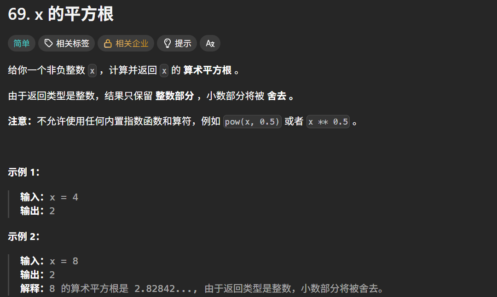
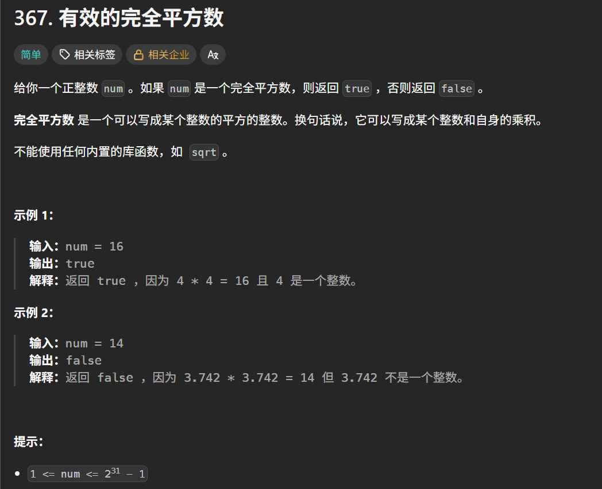
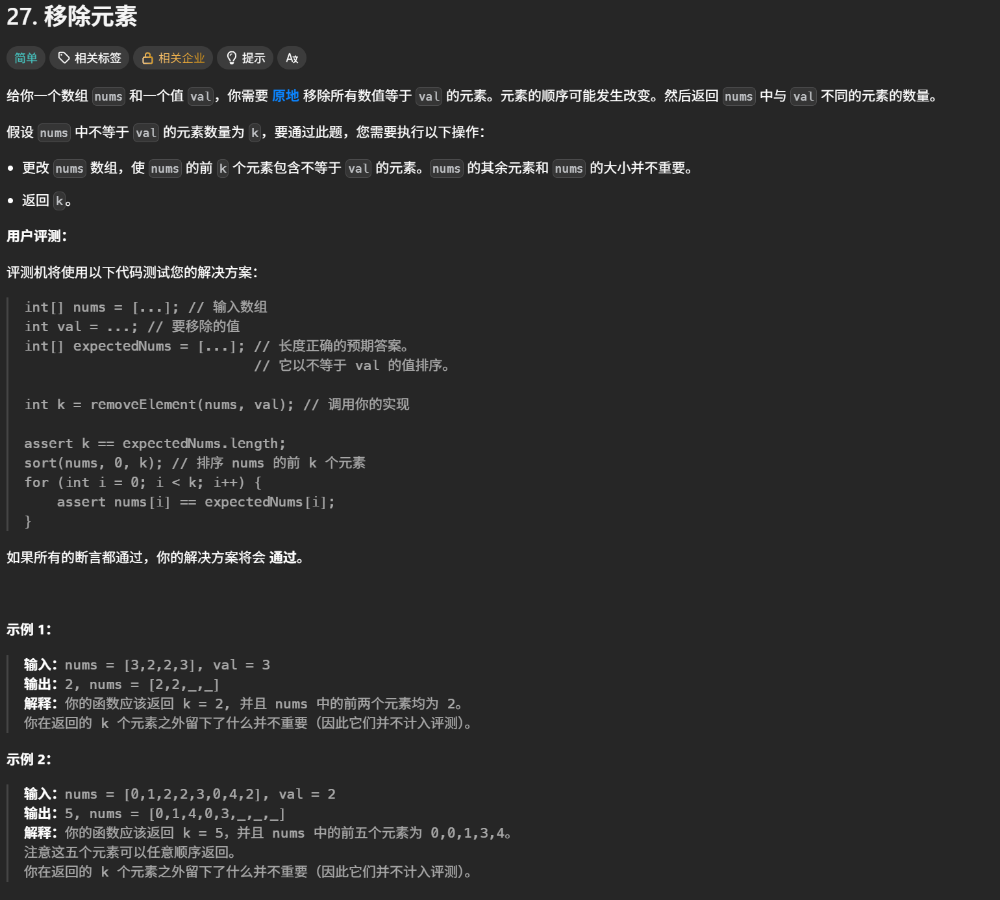
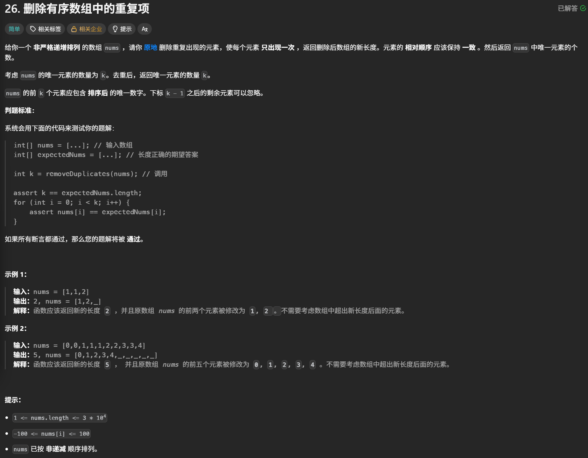
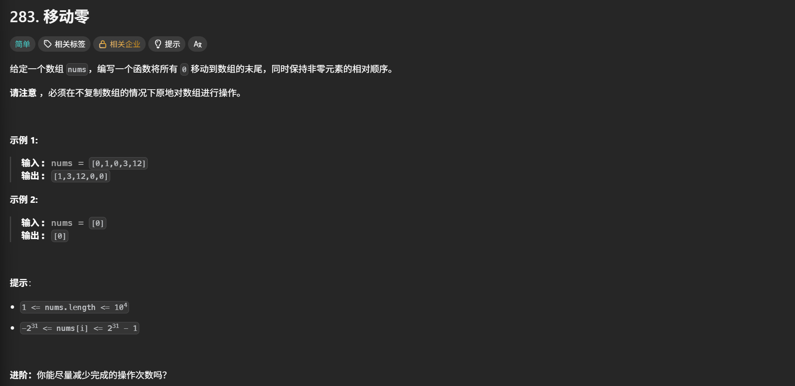
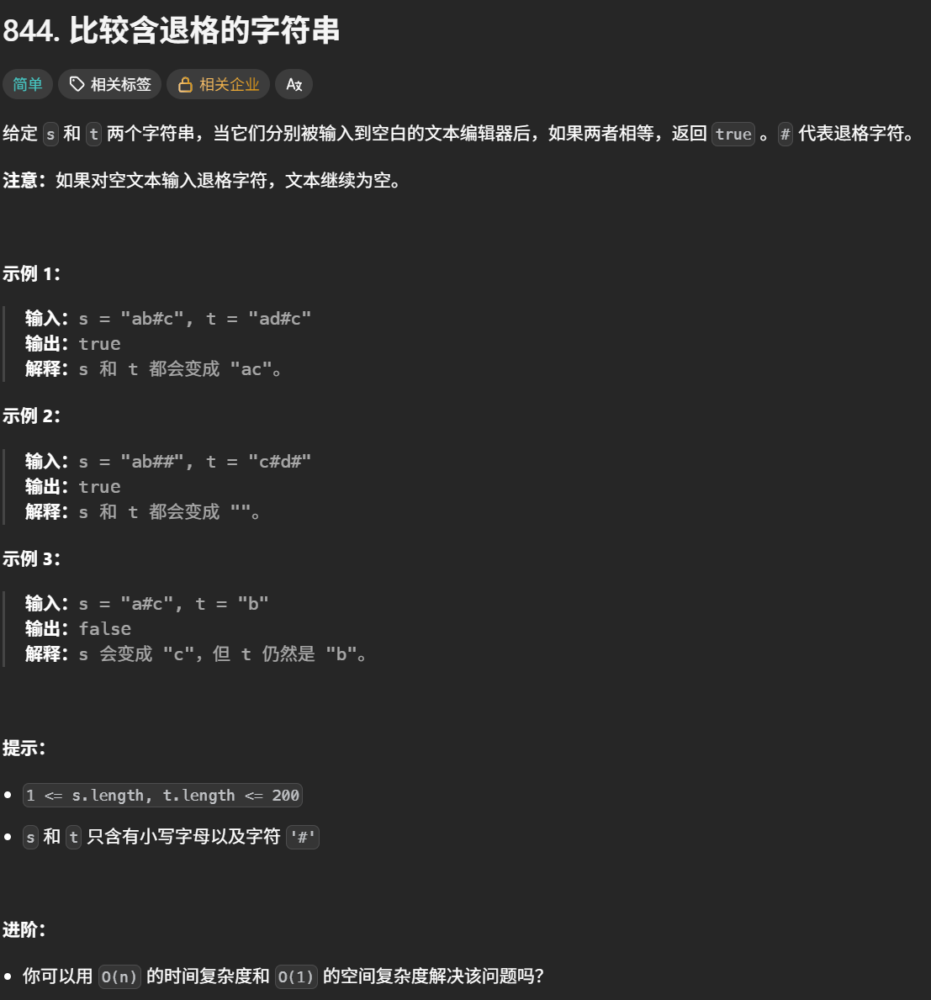
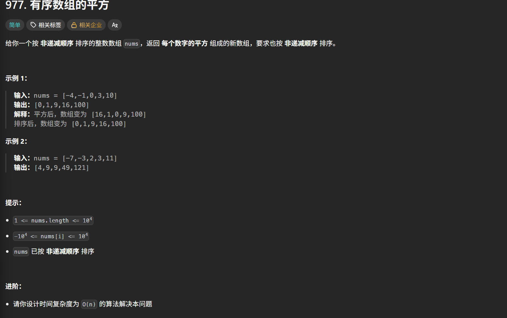
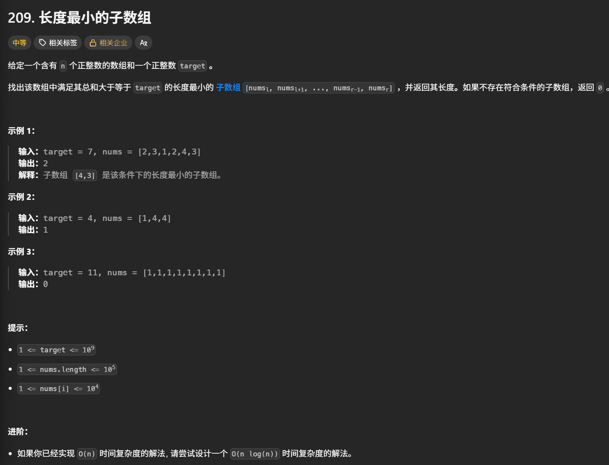

# 数组学习心得

本目录用于保存数组专题的实现代码，并持续记录个人学习心得。

## 今日资料

- 《代码随想录》数组（V3.0）
- 本地资料：`D:\work\算法pdf\1.《代码随想录》数组（V3.0）.pdf`

## 学习内容

- [x] 数组理论基础
- [x] 二分查找
- [x] 移除元素
- [x] 有序数组的平方
- [x] 长度最小的子数组
- [ ] 螺旋矩阵 II
- [ ] 数组总结

## 学习心得

### 核心思路

> #### 数组理论基础
>
> 数组是存储在连续内存空间的相同类型数据的集合。
>
> ##### 需要注意数组元素不能删除，只能覆盖
>
> 

### 易错点与边界条件

> 1. 二分查找有两种方法，一个是左闭右闭区间法，一个是左闭右开区间法，习惯使用左闭右闭区间法，left可以等于right，下一步比较的时候不用包含middle，即right=middle-1或left=middle+1，该方法时间复杂度O(log n),空间复杂度O(1)

### 复杂度总结

> 在这里记录各实现的时间复杂度、空间复杂度及其取舍。

### 复盘

> 在这里记录独立完成情况、需要重做的题目与下一步计划。

## 力扣代码

每道题可单独建立一个目录或源文件，建议使用 `题号-题目名称` 命名，并在代码中注明思路和复杂度。

#### 二分查找

1. [二分查找](https://leetcode.cn/problems/binary-search/)

   

```
class Solution:
    def search(self, nums: List[int], target: int) -> int:
        left = 0
        right = len(nums) - 1
        while left <= right:
            middle = left + (right - left) // 2
            if nums[middle] > target:
                right = middle - 1
            elif nums[middle] < target:
                left = middle + 1
            else: 
                return middle
        return -1
```

2. [搜索插入位置](https://leetcode.cn/problems/search-insert-position/)


```
class Solution:
    def searchInsert(self, nums: List[int], target: int) -> int:
        left,right = 0 , len(nums)-1

        if nums[right] < target:
            return right+1
        elif nums[left] > target:
            return 0

        while left <= right:
            middle = (left + right) // 2
            
            if nums[middle] > target:
                right = middle - 1
            elif nums[middle] < target:
                left = middle +1
            else:
                return middle
        return left     
```

3. [在排序数组中查找元素的第一个和最后一个位置](https://leetcode.cn/problems/find-first-and-last-position-of-element-in-sorted-array/)


这种解法的问题是时间复杂度不满足题目限制，如果数组中所有元素都等于 `target`，寻找左右边界的两段循环最多会遍历整个数组，时间复杂度变成 O(n)，不符合题目要求的 O(log⁡n)。

正确解法：

```
class Solution:
    def searchRange(self, nums: List[int], target: int) -> List[int]:
        #1.target不存在数组中
        #2.target存在数组中，在数组中间
        
        #寻找第一个大于等于value的函数
        def searchFirst(value: int) -> int:
            left , right = 0, len(nums)-1
            while left <= right:
                middle = (left + right) // 2
                if nums[middle] < value:
                    left = middle +1
                else:
                    right = middle -1 
            return left
        
        first = searchFirst(target)
        if first == len(nums) or nums[first] != target:
            return [-1,-1]
        last = searchFirst(target+1)-1
        return [first,last]
```

```
nums = [5,7,7,8,8,10] Target=8
```

第一次查找

```
L=0
R=5
M=2
nums[M]=7<Target
说明M左边的数都不可能是Target，所有直接把左区间改为M+1
```

第二次查找

```
L=3
R=5
M=4
nums[M]=8=Target
说明M的左边和右边都可能有Target，但是要找的是第一个大于等于Target的数，而且M不一定是第一个等于Target的数，不知道左边还有几个Target，所以要缩短右区间，right=M-1
```

第三次查找

```
L=3
R=3
M=3
nums[M]=8=Target
说明M的左边和右边都可能有Target，但是要找的是第一个大于等于Target的数，而且M不一定是第一个等于Target的数，不知道左边还有几个Target，所以要缩短右区间，right=M-1
```

第四次查找

```
L=3
R=2
L>R，循环结束
说明L是第一个等于或大于Target的数
```

判断Target是否存在

```
if first == len(nums) or nums[first] != target:
    return [-1, -1]
    
first == len(nums)目的是判断第一个大于等于Target的下标是否超过数组的下标范围
nums[first] != target目的是判断第一个大于等于Target的数是大于还是等于，如果是大于，就说明数组不存在target
要注意的是first == len(nums)必须放在nums[first] != target前面，目的是为了防止下标越界

```

4. [x 的平方根](https://leetcode.cn/problems/sqrtx/)



```
class Solution:
    def mySqrt(self, x: int) -> int:
        left = 0
        right = x

        while left <= right:
            middle = (left + right)//2
            squre = middle * middle
            if squre == x:
                return middle
            elif squre < x:
                left = middle + 1
            elif squre > x:
                right = middle - 1
        return right
```

还是二分法思路，求k^2在0到x的范围内最大的值，代码中原本没有square变量，导致每次if判断的时候都要计算一次middle的平方，导致运行速度很慢，加入square变量就解决了这个问题。

5. [有效的完全平方数](https://leetcode.cn/problems/valid-perfect-square/description/)



```
class Solution:
    def isPerfectSquare(self, num: int) -> bool:
            left = 0
            right = num
            while left <= right:
                middle = (left + right) // 2
                square = middle * middle
                if square == num:
                    return True
                elif square < num:
                    left = middle + 1
                elif square > num:
                    right  = middle - 1
            return False
```

依然是二分查找法（左闭右闭区间），square小于num，就说明平方根在右边，往右查找，就是左区间=middle+1；square大于num，说明平方根在左边，向左查找，就是右区间=middle-1；如果找到了square等于num，说明找到了num的完全平方根，直接返回True；反之在0到num区间里没有square等于num，说明num没有完全平方根，直接返回False；


#### 移除元素

1. [27. 移除元素](https://leetcode.cn/problems/remove-element/description/)



```
class Solution:
    def removeElement(self, nums: List[int], val: int) -> int:
        #双指针解法
        fastindex,slowindex = 0 , 0
        for fastindex in range(len(nums)):
            if nums[fastindex] != val:
                nums[slowindex] = nums[fastindex]
                slowindex += 1
        return slowindex
```

fastindex指向nums数组中的元素，用fastindex指针寻找不等于val的元素的值
slowindex指向nums数组中元素的下标，用slowindex指针代表新数组元素的下标，slowindex一定指向数组末尾元素的下一个元素下标

2. [26. 删除有序数组中的重复项](https://leetcode.cn/problems/remove-duplicates-from-sorted-array/description/)



```
class Solution:
    def removeDuplicates(self, nums: List[int]) -> int:
        fastindex = 1
        slowindex = 1
        for fastindex in range(len(nums)):
            if nums[fastindex] != nums[slowindex - 1]:
                nums[slowindex] = nums[fastindex]
                slowindex += 1
        return slowindex
```

删除元素采用双指针法，fastindex指向nums数组中的元素，slowindex指向nums数组元素的下标；
对于删除重复元素，只需要判断后一个元素是否等于前一个元素即可，也就是判断nums[fastindex]是否等于nums[slowindex-1],如果等于，说明是重复元素，不要放进新数组中，如果不相等，就放进新数组中。

3. [283. 移动零](https://leetcode.cn/problems/move-zeroes/)



```
class Solution:
    def moveZeroes(self, nums: List[int]) -> None:
        """
        Do not return anything, modify nums in-place instead.
        """
        fastindex = 0
        slowindex = 0
        k = 0
        for fastindex in range(len(nums)):
            if nums[fastindex] != 0:
                nums[slowindex] = nums[fastindex]
                slowindex +=1
        for k in range(slowindex , len(nums)):#range(start, end)是左闭右开区间，包含start，不包含end
            nums[k] = 0
```

思路主要是先把目标元素0全部删除，其他元素赋值到新数组中，删除之后得到的slowindex是指向新数组末尾的下一个元素的下标，只需要把slowindex到原数组nums末尾之间的元素原本赋值0就ok了。
注意range(start, end)是左闭右开区间，比如range（3，5），实际元素只有3和4

4. [844. 比较含退格的字符串](https://leetcode.cn/problems/backspace-string-compare/description/)



```
class Solution:
    def backspaceCompare(self, s: str, t: str) -> bool:
        index_s = len(s) - 1
        index_t = len(t) - 1
        
        while index_s >=0 or index_t >=0:
            is_jinghaos = 0
            #寻找s的有效字符
            while index_s >=0:
                if s[index_s] == "#":#删除的字符个数要加1，同时index_s要往前移一个元素，判断下一个元素是不是#号
                    is_jinghaos +=1
                    index_s -=1
                elif is_jinghaos >0:#说明当前元素不是#号，但是前面有元素是#号，但是不止一个，所以需要index_s每次向前移动一位，移动is_jinghaos位
                    is_jinghaos -=1
                    index_s -= 1
                else:#说明当前元素不是#号，同时后面也没有#号，说明找到了有效元素
                    break
            is_jinghaot = 0
            #寻找t的有效字符
            while index_t >=0:
                if t[index_t] == "#":#删除的字符个数要加1，同时index_t要往前移一个元素，判断下一个元素是不是#号
                    is_jinghaot +=1
                    index_t -=1
                elif is_jinghaot >0:#说明当前元素不是#号，但是前面有元素是#号，但是不止一个，所以需要index_t每次向前移动一位，移动is_jinghaot位
                    is_jinghaot -=1
                    index_t -= 1
                else:#说明当前元素不是#号，同时后面也没有#号，说明找到了有效元素
                    break
            if index_s >=0 and index_t>=0:#先判断两个都有有效字符，如果不相等直接返回False
                if s[index_s]!=t[index_t]:
                    return False
            elif index_s>=0 or index_t>=0:#然后判断一个有有效字符一个没有有效字符，也返回False
                return False
            index_t -=1 #最后index_t和index_s都有往前移动一位，寻找下一个有效字符
            index_s -=1
        return True
```

#### 有序数组的平方

[题目链接](https://leetcode.cn/problems/squares-of-a-sorted-array/description/)



```
class Solution:
    def sortedSquares(self, nums: List[int]) -> List[int]:
        result = [0] * len(nums)
        left = 0
        right = len(nums) - 1
        k = len(nums) - 1
        while left <= right:
            left_square = nums[left]*nums[left]
            right_square = nums[right]*nums[right]
            if left_square < right_square:
                result[k] = right_square
                right -=1
                k -=1
            else:
                result[k] = left_square
                k -=1
                left +=1
        return result

```

思路主要是：平方后的元素最大值一定是来自数组两端
设两个指针，left指向nums左端元素，right指向nums右端元素

每次找到的是当前最大元素的平方，所以要从新数组result末尾开始填写

另外不能直接给空列表赋值，因为空列表里面没有任何位置，所以要创建和原数组长度相同的数组，即result = [0] * len(nums)

#### 长度最小的子数组

1. [209. 长度最小的子数组](https://leetcode.cn/problems/minimum-size-subarray-sum/description/)



```
class Solution:
    def minSubArrayLen(self, target: int, nums: List[int]) -> int:
        #滑动窗口思想
        result = len(nums) + 1 #result 初始值必须是最大长度，这样才能更新最小长度的子数组,必须加1，否则会丢失原数组长度这一个可能
        left = 0 #起始元素下标
        sum = 0 #起始位置到终止位置的元素之和
        sublength = 0 #子数组长度
        for right in range(len(nums)):
            sum += nums[right]
            while sum >= target:
                sublength = right - left + 1
                result = min(result,sublength)
                sum -= nums[left]
                left += 1
        if result != len(nums) + 1:
            return result
        else:
            return 0
```

