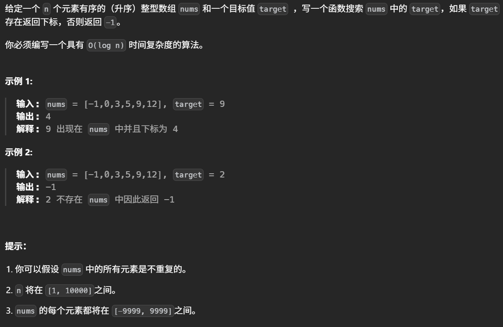
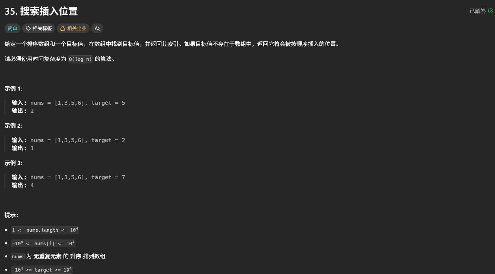
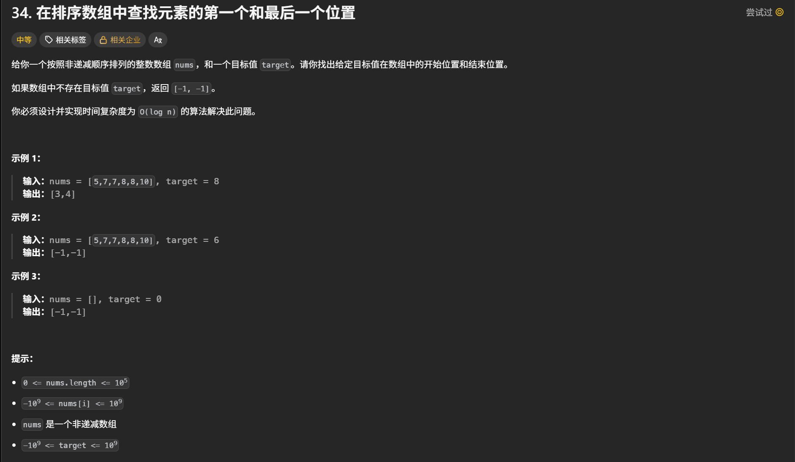
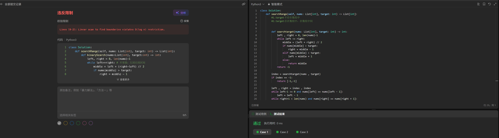

# 数组学习心得

本目录用于保存数组专题的实现代码，并持续记录个人学习心得。

## 今日资料

- 《代码随想录》数组（V3.0）
- 本地资料：`D:\work\算法pdf\1.《代码随想录》数组（V3.0）.pdf`

## 学习内容

- [x] 数组理论基础
- [x] 二分查找
- [ ] 移除元素
- [ ] 有序数组的平方
- [ ] 长度最小的子数组
- [ ] 螺旋矩阵 II
- [ ] 数组总结

## 学习心得

### 核心思路

> #### 数组理论基础
>
> 数组是存储在连续内存空间的相同类型数据的集合。
>
> ##### 需要注意数组元素不能删除，只能覆盖
>
> 

### 易错点与边界条件

> 1. 二分查找有两种方法，一个是左闭右闭区间法，一个是左闭右开区间法，习惯使用左闭右闭区间法，left可以等于right，下一步比较的时候不用包含middle，即right=middle-1或left=middle+1，该方法时间复杂度O(log n),空间复杂度O(1)

### 复杂度总结

> 在这里记录各实现的时间复杂度、空间复杂度及其取舍。

### 复盘

> 在这里记录独立完成情况、需要重做的题目与下一步计划。

## 力扣代码

每道题可单独建立一个目录或源文件，建议使用 `题号-题目名称` 命名，并在代码中注明思路和复杂度。

#### 二分查找

1. [二分查找](https://leetcode.cn/problems/binary-search/)

   

```
class Solution:
    def search(self, nums: List[int], target: int) -> int:
        left = 0
        right = len(nums) - 1
        while left <= right:
            middle = left + (right - left) // 2
            if nums[middle] > target:
                right = middle - 1
            elif nums[middle] < target:
                left = middle + 1
            else: 
                return middle
        return -1
```

2. [搜索插入位置](https://leetcode.cn/problems/search-insert-position/)



```
class Solution:
    def searchInsert(self, nums: List[int], target: int) -> int:
        left,right = 0 , len(nums)-1

        if nums[right] < target:
            return right+1
        elif nums[left] > target:
            return 0

        while left <= right:
            middle = (left + right) // 2
            
            if nums[middle] > target:
                right = middle - 1
            elif nums[middle] < target:
                left = middle +1
            else:
                return middle
        return left     
```

3. [在排序数组中查找元素的第一个和最后一个位置](https://leetcode.cn/problems/find-first-and-last-position-of-element-in-sorted-array/)





这种解法的问题是时间复杂度不满足题目限制，如果数组中所有元素都等于 `target`，寻找左右边界的两段循环最多会遍历整个数组，时间复杂度变成 O(n)，不符合题目要求的 O(log⁡n)。

正确解法：

```
class Solution:
    def searchRange(self, nums: List[int], target: int) -> List[int]:
        #1.target不存在数组中
        #2.target存在数组中，在数组中间
        
        #寻找第一个大于等于value的函数
        def searchFirst(value: int) -> int:
            left , right = 0, len(nums)-1
            while left <= right:
                middle = (left + right) // 2
                if nums[middle] < value:
                    left = middle +1
                else:
                    right = middle -1 
            return left
        
        first = searchFirst(target)
        if first == len(nums) or nums[first] != target:
            return [-1,-1]
        last = searchFirst(target+1)-1
        return [first,last]
```

```
nums = [5,7,7,8,8,10] Target=8
```

第一次查找

```
L=0
R=5
M=2
nums[M]=7<Target
说明M左边的数都不可能是Target，所有直接把左区间改为M+1
```

第二次查找

```
L=3
R=5
M=4
nums[M]=8=Target
说明M的左边和右边都可能有Target，但是要找的是第一个大于等于Target的数，而且M不一定是第一个等于Target的数，不知道左边还有几个Target，所以要缩短右区间，right=M-1
```

第三次查找

```
L=3
R=3
M=3
nums[M]=8=Target
说明M的左边和右边都可能有Target，但是要找的是第一个大于等于Target的数，而且M不一定是第一个等于Target的数，不知道左边还有几个Target，所以要缩短右区间，right=M-1
```

第四次查找

```
L=3
R=2
L>R，循环结束
说明L是第一个等于或大于Target的数
```

判断Target是否存在

```
if first == len(nums) or nums[first] != target:
    return [-1, -1]
    
first == len(nums)目的是判断第一个大于等于Target的下标是否超过数组的下标范围
nums[first] != target目的是判断第一个大于等于Target的数是大于还是等于，如果是大于，就说明数组不存在target
要注意的是first == len(nums)必须放在nums[first] != target前面，目的是为了防止下标越界

```

