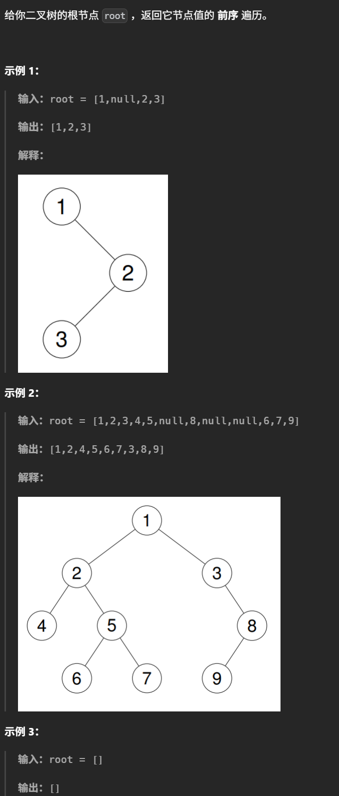
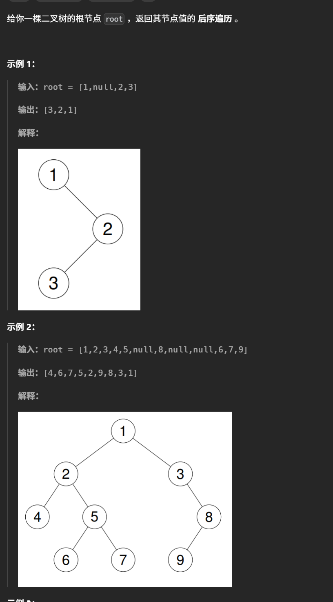
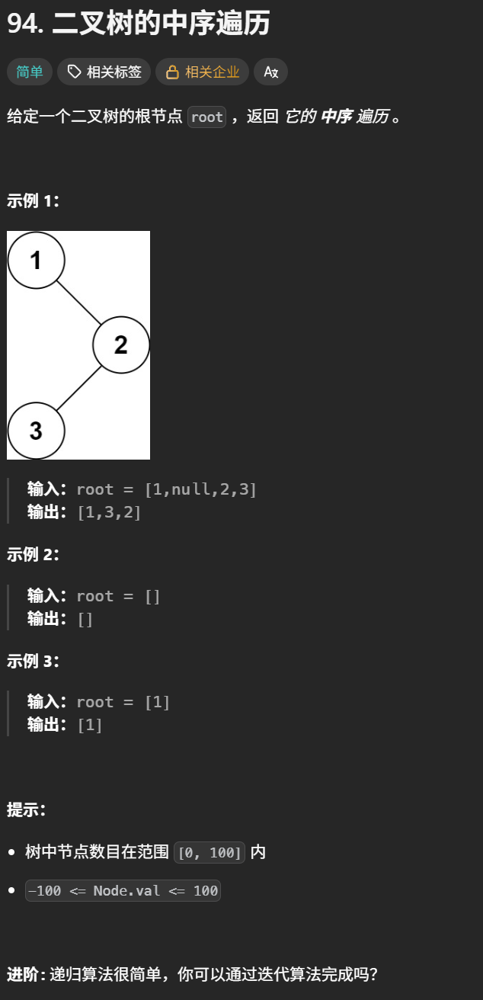

# Binary tree 学习心得

本目录用于记录二叉树专题的实现代码、遍历方法、解题思路、易错点和复盘结论。

## 学习内容

- [x] 二叉树基础与递归遍历
- [ ] 二叉树的迭代遍历
- [ ] 层序遍历
- [ ] 二叉树的属性
- [ ] 二叉搜索树
- [ ] 公共祖先与路径问题
- [ ] 二叉树综合复盘

## 核心思路

- 先明确节点结构、空节点处理方式和遍历顺序，再选择递归或迭代实现。
- 深度优先遍历关注左右子树的递归关系，广度优先遍历使用队列逐层处理。
- 涉及返回值、全局变量或路径状态时，先定义函数的输入、输出和不变量。

## 易错点与边界条件

> 二叉树定义
>
> ```python
> class TreeNode:
>     def __init__(self , val , left = None , right = None):
>         self.val = val
>         self.left = left
>         self.right = right
> ```
>
> #### 写递归函数三要素
>
> 1.确定递归函数的参数和返回值
>
> 2.确定终止条件
>
> 3.确定单层递归逻辑

## 复盘

> 每道题记录遍历方式、递归返回值、状态转移、边界处理、时间复杂度和空间复杂度。

## 代码记录

> 在这里补充每道二叉树题目的题目链接、实现代码和个人学习笔记。

#### 二叉树的前序遍历

[二叉树的前序遍历](https://leetcode.cn/problems/binary-tree-preorder-traversal/description/)



```python
# Definition for a binary tree node.
# class TreeNode:
#     def __init__(self, val=0, left=None, right=None):
#         self.val = val
#         self.left = left
#         self.right = right
class Solution:
    def preorderTraversal(self, root: Optional[TreeNode]) -> List[int]:
        res = []
        def digui(node):
            if node is None:
                return
            res.append(node.val)
            digui(node.left)
            digui(node.right)
        digui(root)
        return res
```

#### 二叉树后序遍历

[二叉树后续遍历](https://leetcode.cn/problems/binary-tree-postorder-traversal/description/)



```python
# Definition for a binary tree node.
# class TreeNode:
#     def __init__(self, val=0, left=None, right=None):
#         self.val = val
#         self.left = left
#         self.right = right
class Solution:
    def postorderTraversal(self, root: Optional[TreeNode]) -> List[int]:
        res = []
        def digui(node):
            if node is None:
                return
            digui(node.left)
            digui(node.right)
            res.append(node.val)
        digui(root)
        return res
```

#### 二叉树的中序遍历

[二叉树的中序遍历](https://leetcode.cn/problems/binary-tree-inorder-traversal/description/)



```python
# Definition for a binary tree node.
# class TreeNode:
#     def __init__(self, val=0, left=None, right=None):
#         self.val = val
#         self.left = left
#         self.right = right
class Solution:
    def inorderTraversal(self, root: TreeNode | None) -> list[int]:
        res = []
        def digui(node):
            if node is None:
                return
            digui(node.left)
            res.append(node.val)
            digui(node.right)
        digui(root)
        return res
```
