# Binary tree 学习心得

本目录用于记录二叉树专题的实现代码、遍历方法、解题思路、易错点和复盘结论。

## 学习内容

- [x] 二叉树基础与递归遍历
- [x] 二叉树的迭代遍历
- [x] 二叉树的统一迭代法
- [x] 层序遍历
- [x] 翻转二叉树
- [x] 对称二叉树
- [ ] 二叉树的属性
- [ ] 二叉搜索树
- [ ] 公共祖先与路径问题
- [ ] 二叉树综合复盘

## 核心思路

- 先明确节点结构、空节点处理方式和遍历顺序，再选择递归或迭代实现。
- 深度优先遍历关注左右子树的递归关系，广度优先遍历使用队列逐层处理。
- 涉及返回值、全局变量或路径状态时，先定义函数的输入、输出和不变量。

## 易错点与边界条件

> 二叉树定义
>
> ```python
> class TreeNode:
>     def __init__(self , val , left = None , right = None):
>         self.val = val
>         self.left = left
>         self.right = right
> ```
>
> #### 写递归函数三要素
>
> 1.确定递归函数的参数和返回值
>
> 2.确定终止条件
>
> 3.确定单层递归逻辑

## 复盘

> 每道题记录遍历方式、递归返回值、状态转移、边界处理、时间复杂度和空间复杂度。

## 代码记录

> 在这里补充每道二叉树题目的题目链接、实现代码和个人学习笔记。

#### 二叉树的前序遍历

[二叉树的前序遍历](https://leetcode.cn/problems/binary-tree-preorder-traversal/description/)

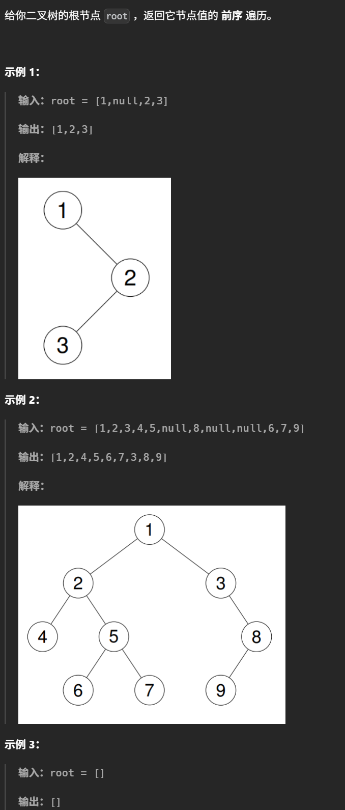

##### 递归遍历

```python
# Definition for a binary tree node.
# class TreeNode:
#     def __init__(self, val=0, left=None, right=None):
#         self.val = val
#         self.left = left
#         self.right = right
class Solution:
    def preorderTraversal(self, root: Optional[TreeNode]) -> List[int]:
        res = []
        def digui(node):
            if node is None:
                return
            res.append(node.val)
            digui(node.left)
            digui(node.right)
        digui(root)
        return res
```

##### 迭代遍历

注意：比如前序遍历（中左右），要先把中节点放入栈，**再放右节点，再放左节点**。要以**出栈的顺序**为准。

```python
class Solution:
    def preorderTraversal(self, root: Optional[TreeNode]) -> List[int]:
        if root is None:
            return []
        #定义栈
        stack = [root]#先把中节点放进去
        #定义结果列表
        result = []
        while stack:#栈不为空
            #处理栈顶的节点
            node = stack.pop()
            #先处理中节点
            result.append(node.val)
            #处理右节点---以出栈的顺序为准
            if node.right is not None:
                stack.append(node.right)
            #再处理左节点---以出栈的顺序为准
            if node.left is not None:
                stack.append(node.left)
        return result
```

##### 统一迭代法

要点就是在中结点后加一个空指针，另外要以出栈的顺序为准

```python
class Solution:
    def preorderTraversal(self, root: Optional[TreeNode]) -> List[int]:
        if root is None:
            return []
        #定义栈
        stack = [root]#先把中节点放进去
        #定义结果列表
        result = []
        while stack:#栈不为空
            node = stack.pop()
            if node:
                if node.right:
                    stack.append(node.right)
                if node.left:
                    stack.append(node.left)
                stack.append(node)
                stack.append(None)
            else:
                node = stack.pop()
                result.append(node.val)
        return result
```


#### 二叉树后序遍历

[二叉树后续遍历](https://leetcode.cn/problems/binary-tree-postorder-traversal/description/)

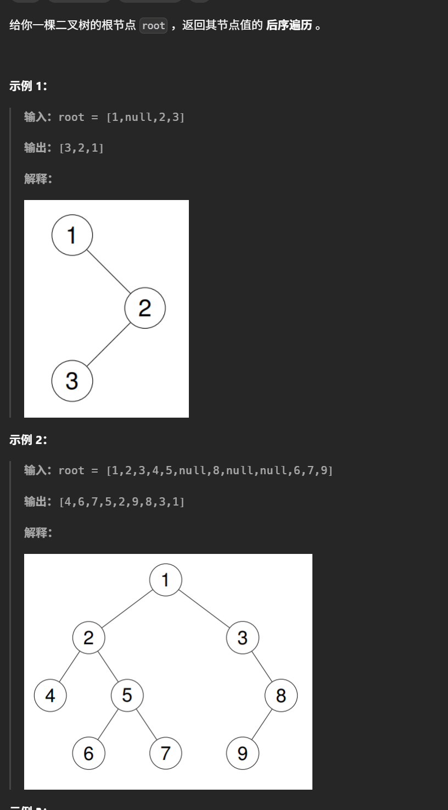

##### 递归遍历

```python
# Definition for a binary tree node.
# class TreeNode:
#     def __init__(self, val=0, left=None, right=None):
#         self.val = val
#         self.left = left
#         self.right = right
class Solution:
    def postorderTraversal(self, root: Optional[TreeNode]) -> List[int]:
        res = []
        def digui(node):
            if node is None:
                return
            digui(node.left)
            digui(node.right)
            res.append(node.val)
        digui(root)
        return res
```

##### 迭代遍历

改前序遍历的逻辑即可：
后序遍历的逻辑是左右中。前序遍历的逻辑是中左右，所有中左右--》中右左--》反转result数组就是左右中

```python
class Solution:
    def postorderTraversal(self, root: Optional[TreeNode]) -> List[int]:
        if root is None:
            return []
        #定义栈
        stack = [root]
        #定义结果数组
        result = []
        while stack:#栈不为空
            #先处理栈顶结点
            node = stack.pop()
            #存入值
            result.append(node.val)
            #再处理左结点
            if node.left:
                stack.append(node.left)
            #最后处理右节点
            if node.right:
                stack.append(node.right)
        return result[::-1]#起始位置：结束位置：遍历方向  -1代表从后往前遍历，起始位置和结束位置为空代表按照默认的，所有result[::-1]代表翻转数组，顺序变成了左右中
```

##### 统一迭代法

```python
class Solution:
    def postorderTraversal(self, root: Optional[TreeNode]) -> List[int]:
        if root is None:
            return []
        #定义栈
        stack = [root]
        #定义结果数组
        result = []
        while stack:#栈不为空
            node = stack.pop()
            if node:
                stack.append(node)
                stack.append(None)
                if node.right:
                    stack.append(node.right)
                if node.left:
                    stack.append(node.left)
            else:
                node = stack.pop()
                result.append(node.val)
        return result
```


#### 二叉树的中序遍历

[二叉树的中序遍历](https://leetcode.cn/problems/binary-tree-inorder-traversal/description/)

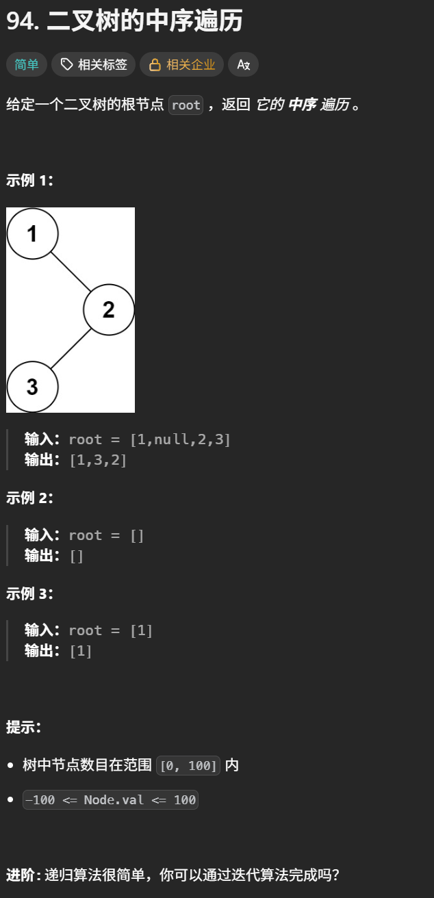

```python
# Definition for a binary tree node.
# class TreeNode:
#     def __init__(self, val=0, left=None, right=None):
#         self.val = val
#         self.left = left
#         self.right = right
class Solution:
    def inorderTraversal(self, root: TreeNode | None) -> list[int]:
        res = []
        def digui(node):
            if node is None:
                return
            digui(node.left)
            res.append(node.val)
            digui(node.right)
        digui(root)
        return res
```

##### 迭代遍历

注意：中序遍历的思路和前序遍历的思路不一样，他要用一个指针来辅助遍历

```python
class Solution:
    def inorderTraversal(self, root: TreeNode | None) -> list[int]:
        if root is None:
            return []
        #定义栈
        stack = []
        #定义结果列表
        result = []
        #定义指针，用来遍历节点，从根节点开始
        cur = root
        while cur or stack:#两个全空就结束了
            if cur:#指针指向的节点非空
                stack.append(cur)
                cur = cur.left
            else:#指针指向的节点为空
                cur = stack.pop()#让指针指向栈顶结点，并弹出栈顶结点  左
                result.append(cur.val)
                cur = cur.right                   #                右
        return result
```

##### 统一迭代法

```python
class Solution:
    def inorderTraversal(self, root: TreeNode | None) -> list[int]:
        if root is None:
            return []
        #定义栈
        stack = [root]
        #定义结果列表
        result = []
        while stack:
            node = stack.pop()
            if node:
                if node.right:
                    stack.append(node.right)
                stack.append(node)
                stack.append(None)
                if node.left:
                    stack.append(node.left)
            else:
                node = stack.pop()
                result.append(node.val)
        return result
```

#### 层序遍历

[二叉树的层序遍历](https://leetcode.cn/problems/binary-tree-level-order-traversal/)

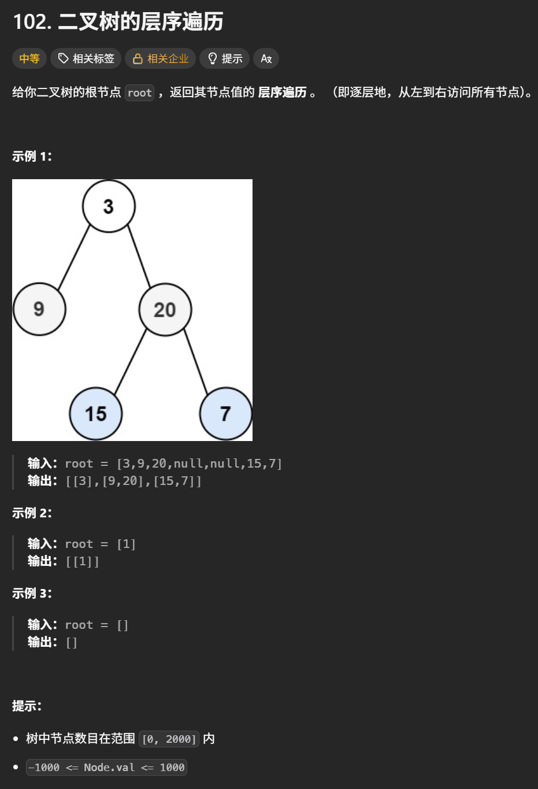

```python
class Solution:
    def levelOrder(self, root: TreeNode | None) -> list[list[int]]:
        if not root:
            return []
        #定义一个双端的队列
        myque = deque([root])#[root] 是只含一个节点的列表
        #定义结果列表
        result = []
        while myque:
            level = []#保存每一层的遍历结果
            for _ in range(len(myque)):
                cur = myque.popleft()
                level.append(cur.val)
                if cur.left:
                    myque.append(cur.left)
                if cur.right:
                    myque.append(cur.right)
            result.append(level)
        return result
```

##### 递归法


```python
class Solution:
    def levelOrder(self, root: TreeNode | None) -> list[list[int]]:
        if not root:
            return []
        #存储每一层的结点值
        levels = []
        def mydigui(node , level):
            if not node:
                return []
            #结束条件
            if len(levels) == level:#在第一次到达某一层时，为这一层创建一个空列表
#第一次到达第 0 层：levels 是 []，长度为 0，于是加入一个空列表，变成 [[]]。
#第一次到达第 1 层：levels 是 [[根节点的值]]，长度为 1，于是再加入一个空列表。之后再次到达第 1 层：levels 已经有两层，长度为 2，无需重复创建。
                levels.append([])
            levels[level].append(node.val)
            mydigui(node.left , level + 1)
            mydigui(node.right , level + 1)
        mydigui(root , 0)
        return levels
```

#### 二叉树的层序遍历Ⅱ

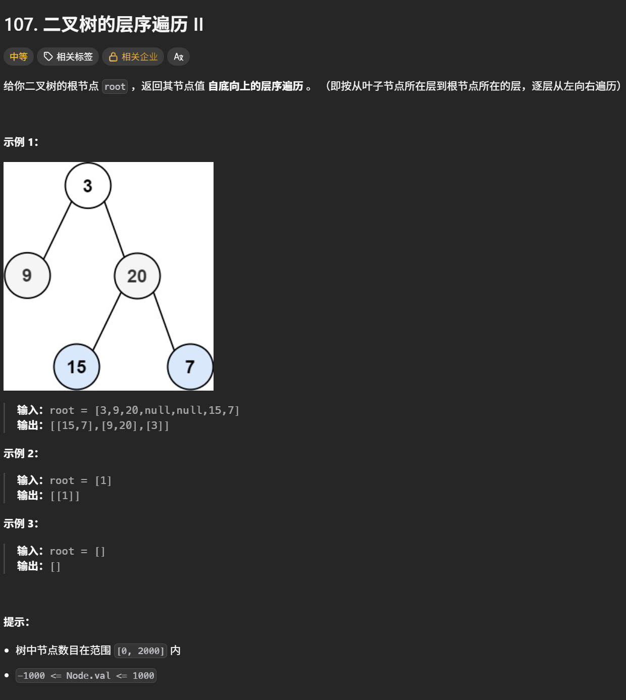

[二叉树的层序遍历Ⅱ](https://leetcode.cn/problems/binary-tree-level-order-traversal-ii/description/)

```python
class Solution:
    def levelOrderBottom(self, root: TreeNode | None) -> list[list[int]]:
        if not root:
            return []
        #定义一个双端队列
        myque = deque([root])
        #定义结果列表
        result = []
        while myque:
            level = []#保存每一层的遍历结果
            for _ in range(len(myque)):
                cur = myque.popleft()
                level.append(cur.val)
                if cur.left:
                    myque.append(cur.left)
                if cur.right:
                    myque.append(cur.right)
            result.append(level)
        return result[::-1]
```

其实就是从上往下层序遍历的结果进行反转

##### 递归法

```python
class Solution:
    def levelOrderBottom(self, root: TreeNode | None) -> list[list[int]]:
        if not root:
            return []
        #存储每一层的结点值
        levels = []
        def digui(node , level):
            if not node:
                return []
            #到达某一层的时候，初始化一个空的列表
            if len(levels) == level:
                levels.append([])
            levels[level].append(node.val)
            digui(node.left , level + 1)
            digui(node.right , level + 1)
        digui(root , 0)
        return levels[::-1]
```

#### 二叉树的右视图

[二叉树的右视图](https://leetcode.cn/problems/binary-tree-right-side-view/description/)

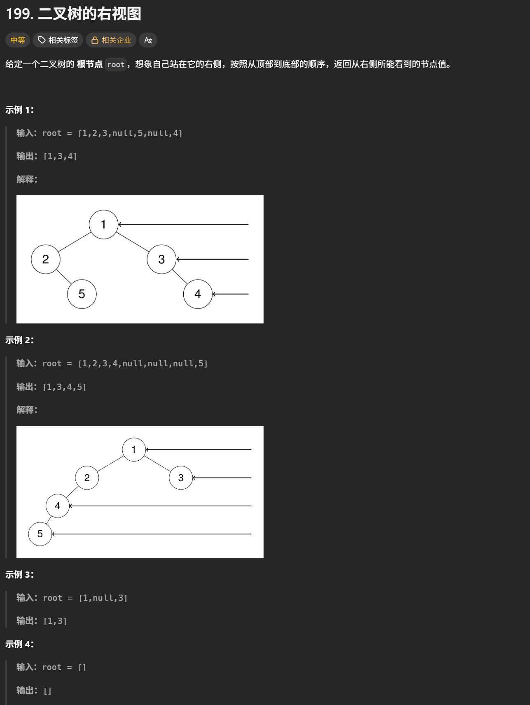

```python
class Solution:
    def rightSideView(self, root: Optional[TreeNode]) -> List[int]:
        #先判断root是否为空
        if not root:
            return []
        #定义结果数组
        result = []
        #定义两端的队列
        myque = deque([root])
        while myque:
            level_size = len(myque)
            for i in range(level_size):
                cur = myque.popleft()
                if i == level_size - 1:#这三个if必须放在for里面，因为如果把这三个 if 移到 for 外面，就无法逐个检查当前层的节点，也无法逐个把它们的孩子加入队列。
                    result.append(cur.val)
                if cur.left:
                    myque.append(cur.left)
                if cur.right:
                    myque.append(cur.right)
        return result
```

#### 二叉树的层平均值

[二叉树的层平均值](https://leetcode.cn/problems/average-of-levels-in-binary-tree/description/)

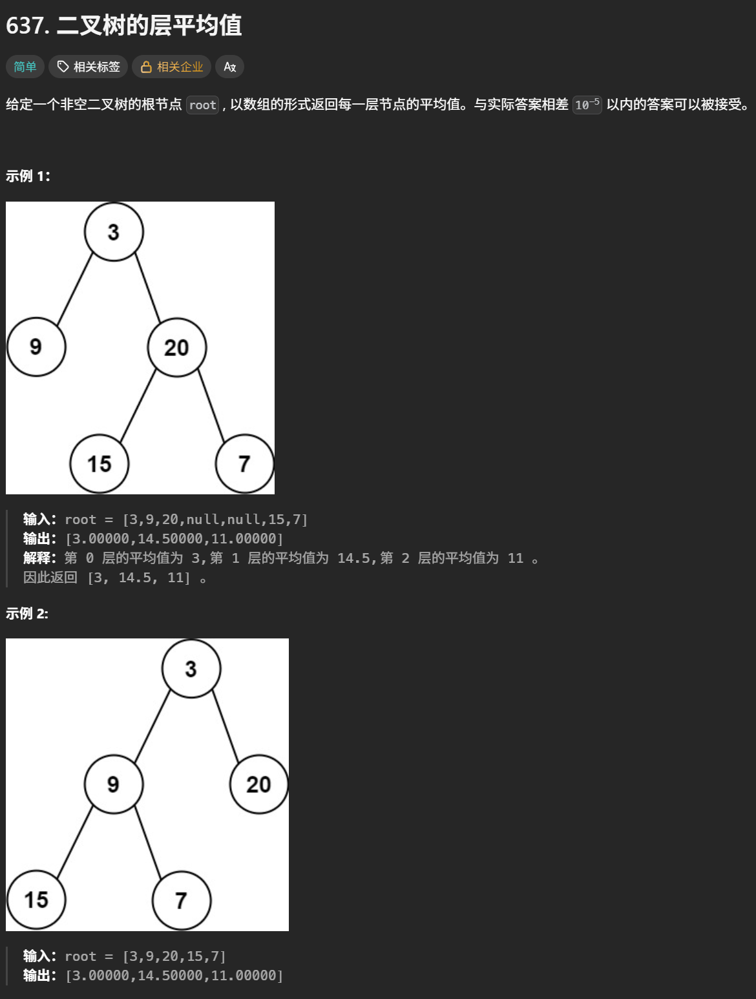

```python
class Solution:
    def averageOfLevels(self, root: TreeNode | None) -> list[float]:
        if not root:
            return []
        #定义结果数组
        result = []
        #定义两端的队列
        myque = deque([root])
        while myque:
            level_size = len(myque)#当前层的长度大小，因为每次刚进入某一层的时候，上一层的元素都被pop掉了
            level_sum = 0#每一层的总和
            for i in range(level_size):
                node = myque.popleft()
                level_sum += node.val
                if node.left:
                    myque.append(node.left)
                if node.right:
                    myque.append(node.right)
            result.append(level_sum / level_size)
        return result
```

#### N叉树的层序遍历

[N叉树的层序遍历](https://leetcode.cn/problems/n-ary-tree-level-order-traversal/description/)

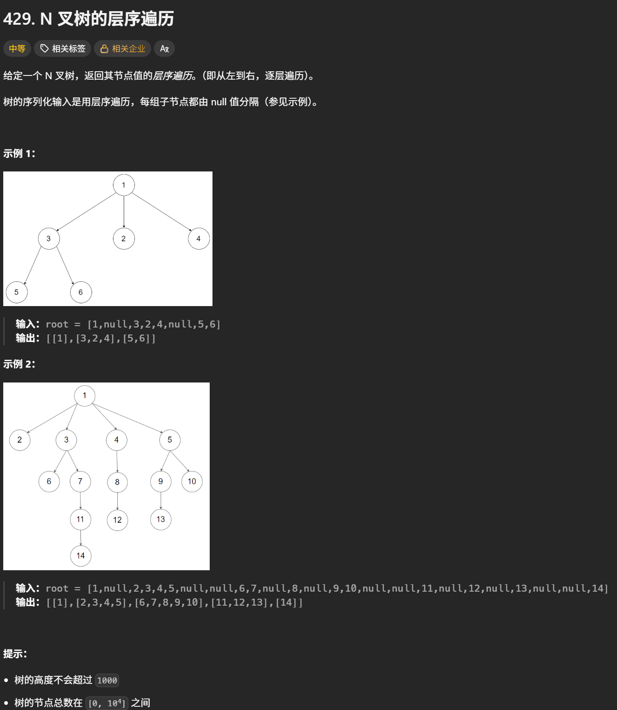

```python
class Solution:
    def levelOrder(self, root: 'Node') -> List[List[int]]:
        if not root:
            return []
        #定义两端的队列
        myque = deque([root])
        #定义结果列表
        result = []
        while myque:
            level_size = len(myque)#获取每一层的长度
            level = []#保存每一层的遍历结果
            for i in range(level_size):
                node = myque.popleft()
                level.append(node.val)
                for child in node.children:
                    myque.append(child)
            result.append(level)
        return result

```

#### 在每个树行中找最大值

[在每个树行中找最大值](https://leetcode.cn/problems/find-largest-value-in-each-tree-row/)

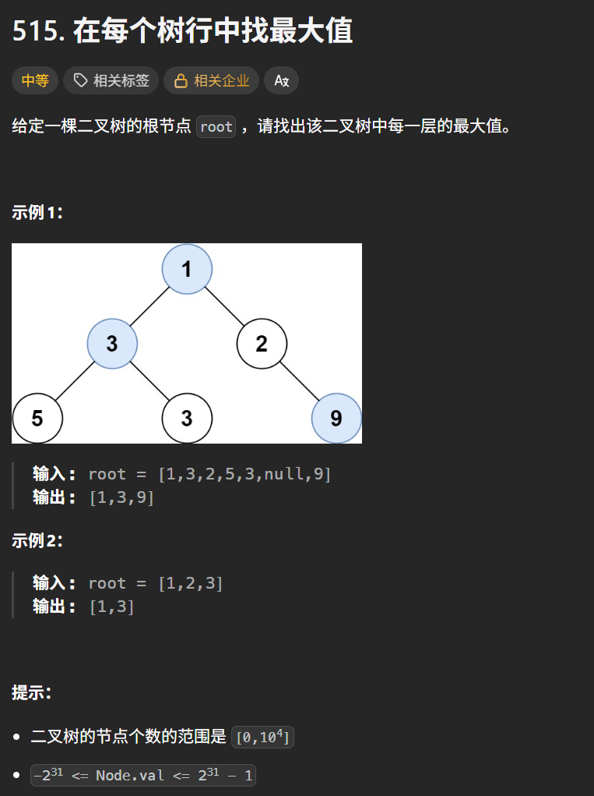

```python
class Solution:
    def largestValues(self, root: TreeNode | None) -> list[int]:
        if not root:
            return []
        #定义结果列表
        result = []
        #定义两端队列
        myque = deque([root])

        while myque:
            #每一层的最大值，不能初始化为0，如果某一层的节点值全部是负数，最大值就会错误地得到 0.所以要把初始值改为负无穷大
            max_value = float('-inf')
            for i in range(len(myque)):
                node = myque.popleft()
                max_value = max(max_value , node.val)
                if node.left:
                    myque.append(node.left)
                if node.right:
                    myque.append(node.right)
            result.append(max_value)
        return result
```

float('-inf')代表负无穷大，float('inf')代表正无穷大

#### 填充每个节点的下一个右侧节点指针

[填充每个节点的下一个右侧节点指针](https://leetcode.cn/problems/populating-next-right-pointers-in-each-node/description/)

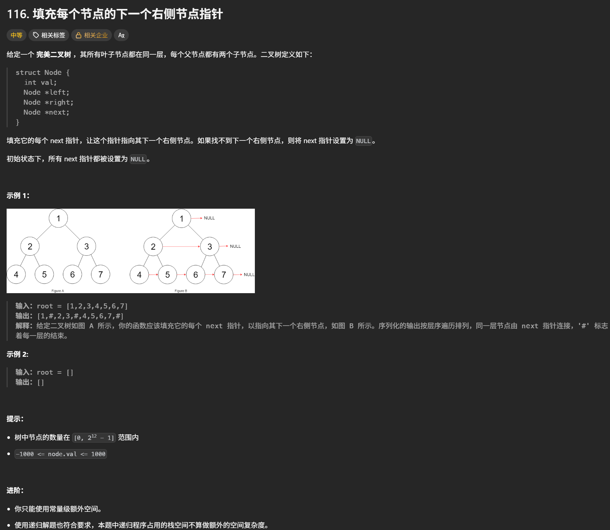

```python

class Solution:
    def connect(self, root: 'Optional[Node]') -> 'Optional[Node]':
        if not root:
            return root
        #定义两端队列
        myque = deque([root])
        #前一个结点
        pre = None
        while myque:
            level_size = len(myque)
            #前一个结点
            pre = None#每一层开始的时候都要更新
            for i in range(level_size):
                node = myque.popleft()
                if pre:
                    pre.next = node
                pre = node
                if node.left:
                    myque.append(node.left)
                if node.right:
                    myque.append(node.right)
        return root
```

#### 填充每个节点的下一个右侧节点指针II

[填充每个节点的下一个右侧节点指针II](https://leetcode.cn/problems/populating-next-right-pointers-in-each-node-ii/description/)

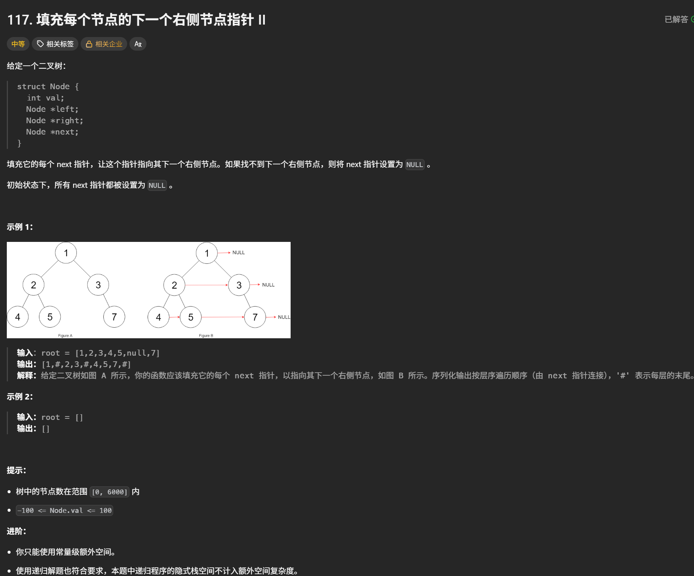

```python
class Solution:
    def connect(self, root: 'Node') -> 'Node':
        if not root:
            return root
        #定义两端队列
        myque = deque([root])
        while myque:
            level_size = len(myque)
            pre = None
            for i in range(level_size):
                node = myque.popleft()
                if pre:
                    pre.next = node
                pre = node
                if node.left:
                    myque.append(node.left)
                if node.right:
                    myque.append(node.right)
        return root
```

#### 二叉树的最大深度

[二叉树的最大深度](https://leetcode.cn/problems/maximum-depth-of-binary-tree/description/)

二叉树的深度就是根节点到最远叶子节点的最长路径上的节点数。

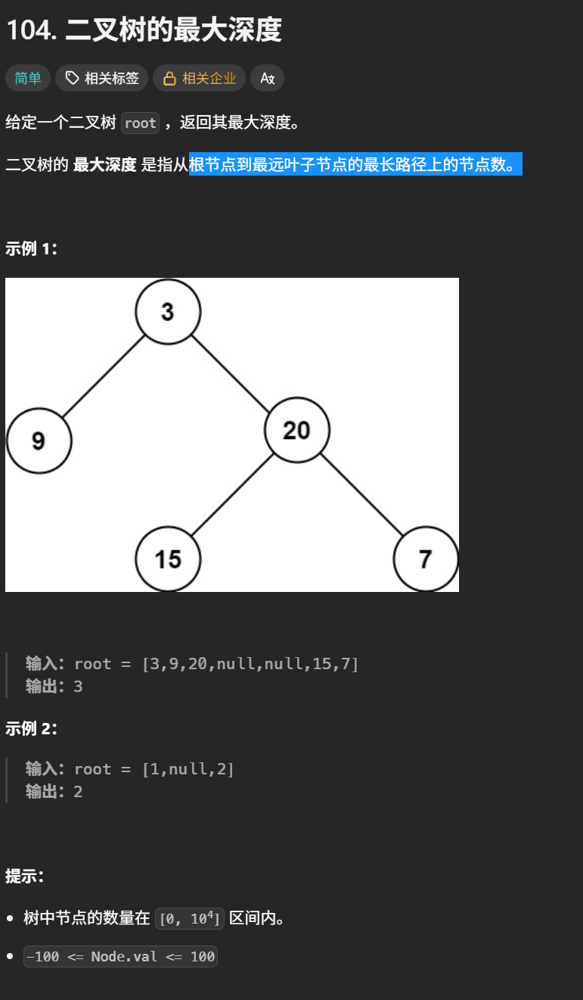

```python
class Solution:
    def maxDepth(self, root: TreeNode | None) -> int:
        if not root:
            return 0
        myque = deque([root])
        deepth = 0
        while myque:
            deepth += 1
            level_size = len(myque)
            for i in range(level_size):
                node = myque.popleft()
                if node.left:
                    myque.append(node.left)
                if node.right:
                    myque.append(node.right)
        return deepth
```

#### 二叉树的最小深度

[二叉树的最小深度](https://leetcode.cn/problems/minimum-depth-of-binary-tree/description/)

最小深度是从根节点到最近叶子节点的最短路径上的节点数量。

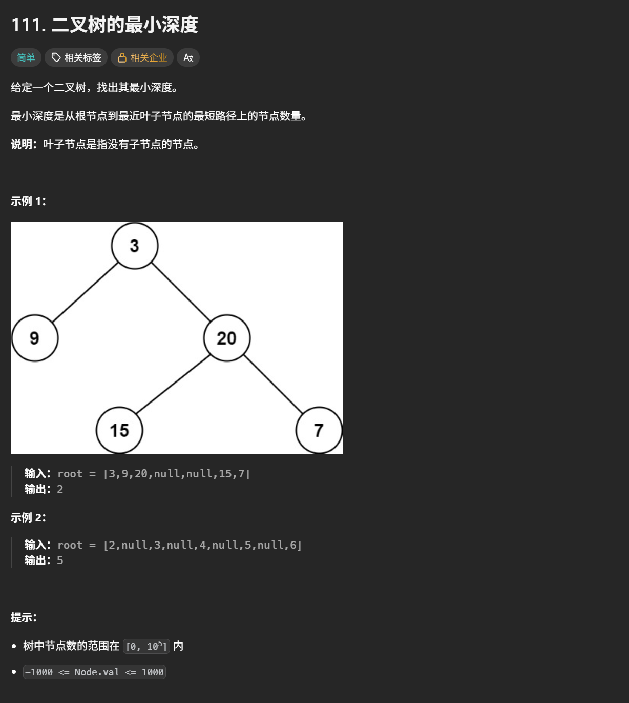

```python
class Solution:
    def minDepth(self, root: TreeNode | None) -> int:
        #只有当左右孩子都为空的时候，才说明遍历的最低点了。如果其中一个孩子为空则不是最低点
        if not root:
            return 0
        myque = deque([root])
        deepth = 0
        while myque:
            deepth += 1
            level_size = len(myque)
            for i in range(level_size):
                node = myque.popleft()
                if node.left:
                    myque.append(node.left)
                if node.right:
                    myque.append(node.right)
                if not node.left and not node.right:
                    return deepth
        return deepth
```

#### 翻转二叉树

[翻转二叉树](https://leetcode.cn/problems/invert-binary-tree/description/)

只要保证每个结点的左右子节点交换就可以

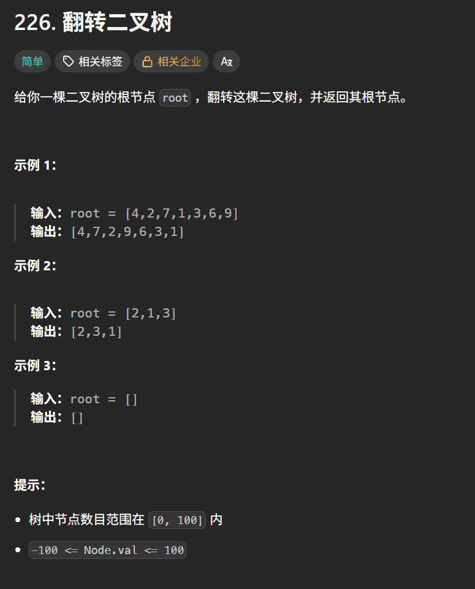

##### 递归法

前序遍历

```python
class Solution:
    def invertTree(self, root: Optional[TreeNode]) -> Optional[TreeNode]:
        if not root:
            return None
        root.left , root.right = root.right , root.left
        self.invertTree(root.left)
        self.invertTree(root.right)
        return root
```

##### 层序遍历

```python
class Solution:
    def invertTree(self, root: Optional[TreeNode]) -> Optional[TreeNode]:
        if not root:
            return None
        myque = deque([root])
        while myque:
            level_size = len(myque)
            for i in range(level_size):
                node = myque.popleft()
                node.left , node.right = node.right , node.left
                if node.left:
                    myque.append(node.left)
                if node.right:
                    myque.append(node.right)
        return root
```

##### 迭代法

```python
class Solution:
    def invertTree(self, root: Optional[TreeNode]) -> Optional[TreeNode]:
        if not root:
            return None
        stack = [root]
        while stack:
            node = stack.pop()
            node.left , node.right = node.right , node.left
            if node.left:
                stack.append(node.left)
            if node.right:
                stack.append(node.right)
        return root
```

#### 对称二叉树

[对称二叉树](https://leetcode.cn/problems/symmetric-tree/description/)

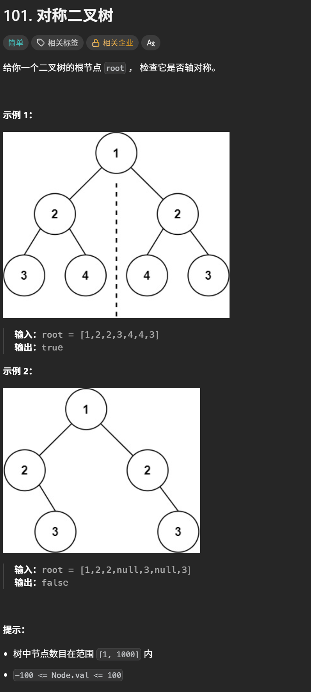

##### 递归法

```python
class Solution:
    def compare(self , left , right):
        #首先排除空结点情况
        if left is None and right is not None:
            return False
        elif left is not None and right is None:
            return False
        elif left is None and right is None:
            return True
        #再排除非空但数值不同的情况
        elif left.val != right.val:
            return False
        #开始递归
        outside = self.compare(left.left , right.right)#外
        inside = self.compare(left.right , right.left)#内
        result = outside and inside
        return result
    def isSymmetric(self, root: TreeNode | None) -> bool:
        if not root:
            return True
        result = self.compare(root.left , root.right)
        return result
```

##### 层序遍历法

```python
class Solution:
    def isSymmetric(self, root: TreeNode | None) -> bool:
        if not root:
            return True
        myque = deque([root])
        while myque:
            level_size = len(myque)
            level_val = []#存储每一层节点的值
            for i in range(level_size):
                node = myque.popleft()
                if node:
                    level_val.append(node.val)
                    myque.append(node.left)
                    myque.append(node.right)
                else:
                    level_val.append(None)
            if level_val != level_val[::-1]:
                return False
        return True
```

#### 相同的树

[相同的树](https://leetcode.cn/problems/same-tree/description/)

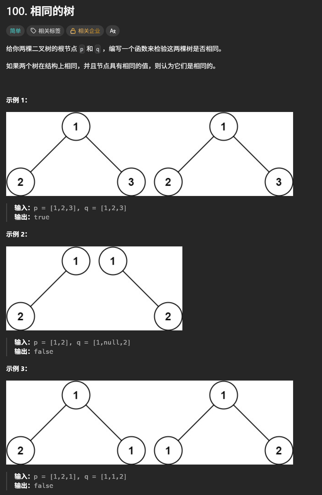

##### 递归法

```python
class Solution:
    def isSameTree(self, p: TreeNode | None, q: TreeNode | None) -> bool:
        if p is not None and q is None:
            return False
        elif p is None and q is not None:
            return False
        elif p is None and q is None:
            return True
        elif p.val != q.val:
            return False
        #已经排除节点为空、不为空但值不同的情况，下面继续比较两棵树对应的子节点的情况
        leftsame = self.isSameTree(p.left , q.left)#比较两个树的左节点是否相同
        rightsame = self.isSameTree(p.right , q.right)#比较两个树的右节点是否相同
        return leftsame and rightsame
```

##### 层序遍历法

```python
class Solution:
    def isSameTree(self, p: TreeNode | None, q: TreeNode | None) -> bool:
        myque_p = deque([p])
        myque_q = deque([q])
        while myque_p and myque_q:
            #去除节点
            node_p = myque_p.popleft()
            node_q = myque_q.popleft()
            #比较节点
            if node_p is None and node_q is None:
                continue
            if node_p is None or node_q is None:
                return False
            if node_p.val != node_q.val:
                return False
            myque_p.append(node_p.left)
            myque_p.append(node_p.right)#即使节点是空的，也要把None放入队列中
            myque_q.append(node_q.left)
            myque_q.append(node_q.right)#即使节点是空的，也要把None放入队列中
        return not myque_p and not myque_q
```

#### 另一颗树的子树

[另一棵树的子树](https://leetcode.cn/problems/subtree-of-another-tree/)

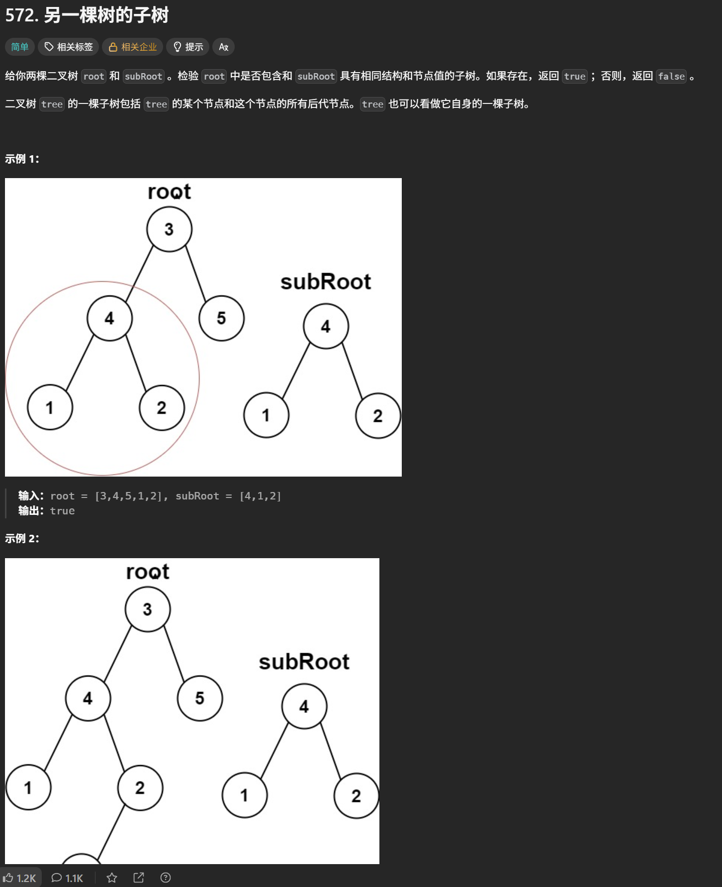

##### 递归法

```python
class Solution:
    def isSame(self , p , q):
        if p is None and q is None:
            return True
        if p is None or q is None:
            return False
        if p.val != q.val:
            return False
        leftsame = self.isSame(p.left , q.left)
        rightsame = self.isSame(p.right , q.right)
        return leftsame and rightsame

    def isSubtree(self, root: Optional[TreeNode], subRoot: Optional[TreeNode]) -> bool:
        if subRoot is None:
            return True
        elif root is None:
            return False
        if self.isSame(root , subRoot):
            return True
        #往下找一下左右节点是否存在另一颗子树
        left = self.isSubtree(root.left , subRoot)
        right = self.isSubtree(root.right , subRoot)
        return left or right
```

##### 层序遍历法

```python
class Solution:
    #用来判断以改起点为根节点的两棵树是否相同
    def isSametree(self , p , q ):
        myque_p = deque([p])
        myque_q = deque([q])
        while myque_p and myque_q:
            #去除节点
            node_p = myque_p.popleft()
            node_q = myque_q.popleft()
            #比较节点
            if node_p is None and node_q is None:
                continue
            if node_p is None or node_q is None:
                return False
            if node_p.val != node_q.val:
                return False
            myque_p.append(node_p.left)
            myque_p.append(node_p.right)#即使节点是空的，也要把None放入队列中
            myque_q.append(node_q.left)
            myque_q.append(node_q.right)#即使节点是空的，也要把None放入队列中
        return not myque_p and not myque_q

    #用来找子树的对应匹配的起点
    def isSubtree(self, root: Optional[TreeNode], subRoot: Optional[TreeNode]) -> bool:
        myque = deque([root])
        while myque:
            node = myque.popleft()
            if self.isSametree(node , subRoot):
                return True
            #说明起点找错了，继续往下找左右子树节点
            if node.left:
                myque.append(node.left)
            if node.right:
                myque.append(node.right)
        #走到这里了，说明没有找到子树
        return False
```

#### N叉树的最大深度

[N叉树的最大深度](https://leetcode.cn/problems/maximum-depth-of-n-ary-tree/)

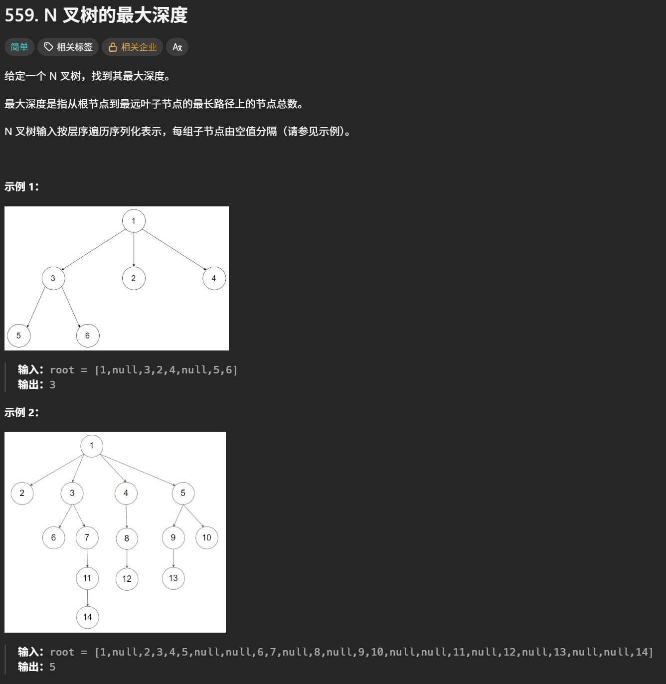

```python
class Solution:
    def maxDepth(self, root: 'Node') -> int:
        if not root:
            return 0
        myque = deque([root])
        maxdepth = 0
        while myque:
            maxdepth += 1
            level_size = len(myque)
            for i in range(level_size):
                node = myque.popleft()
                for child in node.children:
                    myque.append(child)
        return maxdepth
```


#### 完全二叉树的节点个数

[完全二叉树的节点个数](https://leetcode.cn/problems/count-complete-tree-nodes/description/)

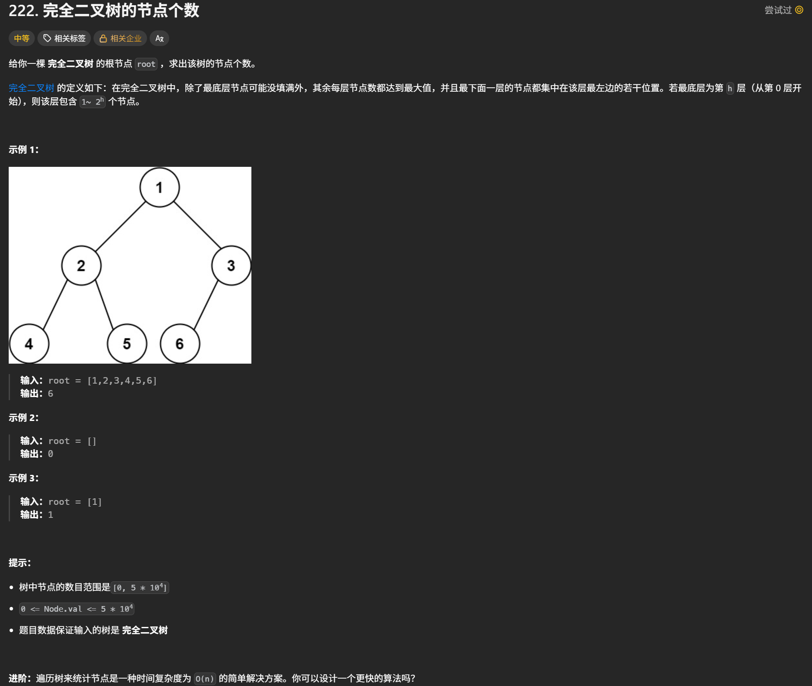

##### 二叉树的层序遍历方法

这个方法统计是正确的，但是效率不满足力扣的条件

```python
class Solution:
    def countNodes(self, root: Optional[TreeNode]) -> int:
        if not root:
            return 0
        myque = deque([root])
        result = 0
        while myque:
            level_size = len(myque)
            for i in range(level_size):
                result += 1#记录节点数量
                node = myque.popleft()
                if node.left:
                    myque.append(node.left)
                if node.right:
                    myque.append(node.right)
        return result
```

##### 递归法

```python
class Solution:
    def countNodes(self, root: Optional[TreeNode]) -> int:
        if not root:
            return 0
        #分别统计从根节点出发的最左路径和最右路径的高度
        node = root
        left_height = 0
        while node:
            left_height += 1
            node = node.left

        node = root
        right_height = 0
        while node:
            right_height += 1
            node = node.right
        #如果左右子树的最大高度相同，说明是满二叉树
        if left_height == right_height:
            return 2 ** left_height - 1
        else:
            return (self.countNodes(root.left) + self.countNodes(root.right) + 1)#加1是加上根节点，到这里的时候node已经是None了
```

#### 平衡二叉树

[平衡二叉树](https://leetcode.cn/problems/balanced-binary-tree/description/)

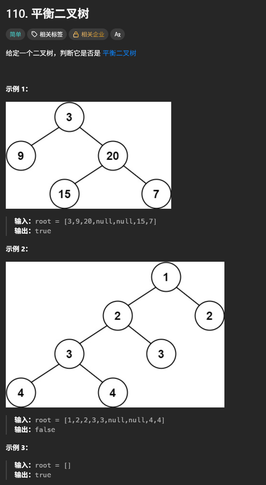

##### 递归法

```python
class Solution:
    #用来获取改节点的高度
    #如果以该节点为根节点，他不是平衡二叉树，即左右子树高度差超过1，那么返回-1
    #如果是二叉树，即左右子树高度差小于等于1，那么返回该节点的高度值
    def getHeight(self , node):
        #确认终止条件
        if node is None:
            return 0
        #确认单层递归逻辑:后序遍历用来求高度
        leftHeight = self.getHeight(node.left)
        if leftHeight == -1:
            return -1
        rightHeight = self.getHeight(node.right)
        if rightHeight == -1:
            return -1
        if abs(leftHeight - rightHeight) > 1:#不是平衡二叉树
            return -1
        else:#左右子树高度差小于等于1，是平衡二叉树
            return (1 + max(leftHeight , rightHeight))
    def isBalanced(self, root: TreeNode | None) -> bool:
        if self.getHeight(root) == -1:
            return False
        else:
            return True
```

#### 二叉树的所有路径

[二叉树的所有路径](https://leetcode.cn/problems/binary-tree-paths/description/)

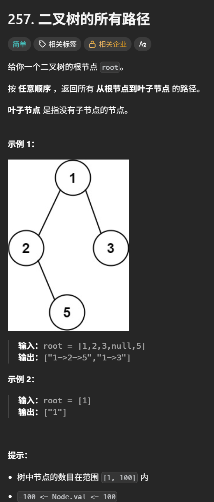

```python
class Solution:
    #首先确认递归参数：当前节点、path数组记录路径值、result列表记录结果，字符串类型
    #终止条件是遇到叶节点，即当前节点不为空，但是左右子节点为空
    def mydigui(self , node , path , result):
        #单层递归遍历，前序遍历
        path.append(node.val)#中
        #终止条件
        if node.left is None and node.right is None:
            str_path = '->'.join(map(str , path))#map是迭代器，用来把path这个对象转换为str类型
            result.append(str_path)
            return result
        #单层递归遍历，前序遍历
        if node.left:#左
            self.mydigui(node.left , path , result)
            path.pop()#回溯
        if node.right:
            self.mydigui(node.right , path , result)
            path.pop()#回溯

    def binaryTreePaths(self, root: TreeNode | None) -> list[str]:
        path = []
        result = []
        if root is None:
            return result
        self.mydigui(root , path , result)
        return result
```
