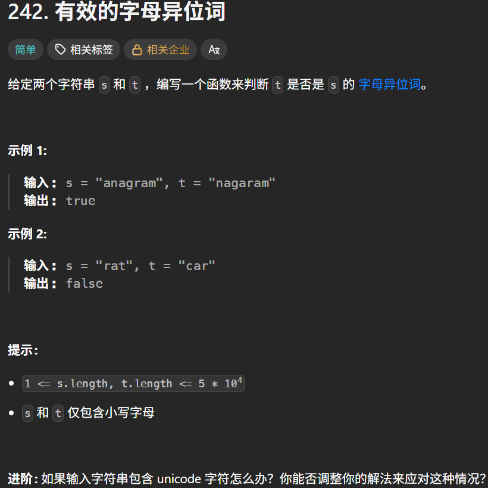
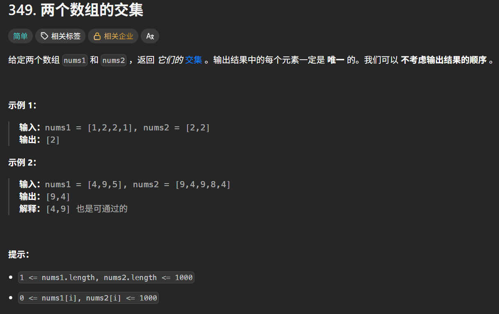
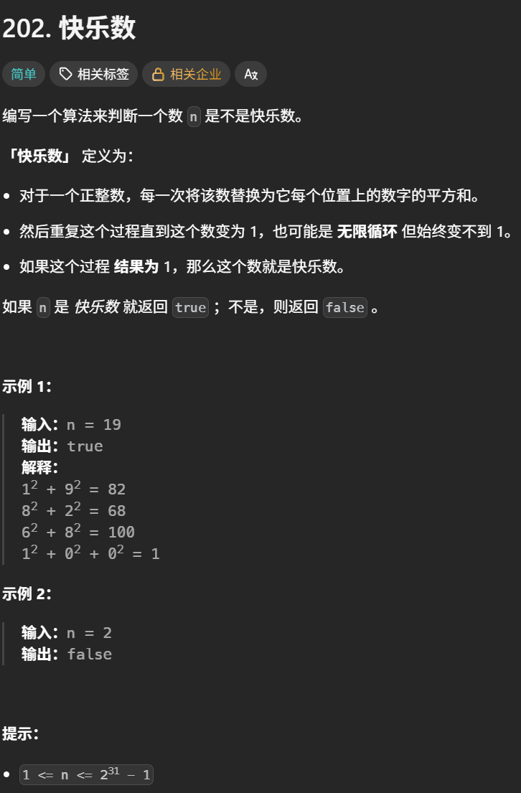

# 哈希表学习心得

本目录用于保存哈希表专题的实现代码，并记录算法思路、易错点和个人复盘。

## 学习内容

- [x] 哈希表理论基础
- [x] 有效的字母异位词
- [x] 两个数组的交集
- [ ] 快乐数
- [ ] 两数之和
- [ ] 四数相加 II
- [ ] 赎金信
- [ ] 三数之和
- [ ] 四数之和

## 核心思路

- `set`：只关心元素是否出现，适合去重和快速判断存在性。
- `dict`：保存“键—值”映射，适合统计频次、记录下标或保存计算结果。
- 先确定查询条件，再选择键和值；键必须可哈希，字典中的键不重复。

## 易错点与边界条件

> 在这里记录空输入、重复元素、负数、频次更新、键的删除以及时间和空间复杂度等问题。

## 复盘

> 每道题记录遇到的问题、错误原因、修正方法和需要重做的内容。

## 代码记录

#### 有效的字母异位词

[有效的字母异位词](https://leetcode.cn/problems/valid-anagram/description/)



```python
class Solution:
    def isAnagram(self, s: str, t: str) -> bool:
        record = [0] * 26 #定义一个长度为
        #记录t中的每个字母出现的次数
        for i in t:
            record[ord(i) - ord('a')] += 1
        #记录s中的每个字母出现的次数
        for i in s:
            record[ord(i) - ord('a')] -= 1
        #判断record数组里是否全为0
        for i in range(26):
            if record[i] != 0:
                return False
        return True
```

ord(单个字符),用于将单个字符转换为对应的Unicode编码整数

#### 两个数组的交集

[两个数组的交集](https://leetcode.cn/problems/intersection-of-two-arrays/description/)



##### 使用数组的方法

```python
class Solution:
    def intersection(self, nums1: List[int], nums2: List[int]) -> List[int]:
        #这道题没有限制数组大小，所以不能使用数组来做哈希表
        count1 = [0] * 1001
        count2 = [0] * 1001
        result = []
        #统计nums1数组中每个数字出现的次数
        for i in range(len(nums1)):
            count1[nums1[i]] += 1
        #统计nums2数组中每个数字出现的次数
        for i in range(len(nums2)):
            count2[nums2[i]] += 1
        #查找两个数组中相同的元素
        for k in range(1001):
            if count1[k] * count2[k] != 0:#说明第k个元素两个数组都有
                result.append(k)
        return result
```

##### 使用集合的方法

```python
class Solution:
    def intersection(self, nums1: List[int], nums2: List[int]) -> List[int]:
        #set(nums),将nums转换为集合
        #集合内的元素不可重复，两个集合之间可以进行取交集操作，取并集的操作
        #  集合1  &  集合2  =可以取出两个集合的交集
        #  集合1  |  集合2  =可以取出两个集合的并集
        #  list() 可以将括号内的数据类型转换为字典类型
        return list(set(nums1) & set(nums2))
```

#### 快乐数

[快乐数](https://leetcode.cn/problems/happy-number/description/)



```python
class Solution:
    def getsum(self , n : int) -> int:
        newsum = 0
        while n:
            n , r = divmod(n , 10)#得到除以10的商和余数
            newsum += r**2
        return newsum
    def isHappy(self, n: int) -> bool:
        record = set() #记录sum是否重复出现
        while True:
            n = self.getsum(n) #获取每个位置上数的平方和
            if n == 1:
                return True
            if n in record:#只要n重复出现了，就不是快乐数
                return False
            else:
                record.add(n)
```

divmod（a,b）用来同时计算两个数相除的商和余数。等价于（a // b , a % b）
