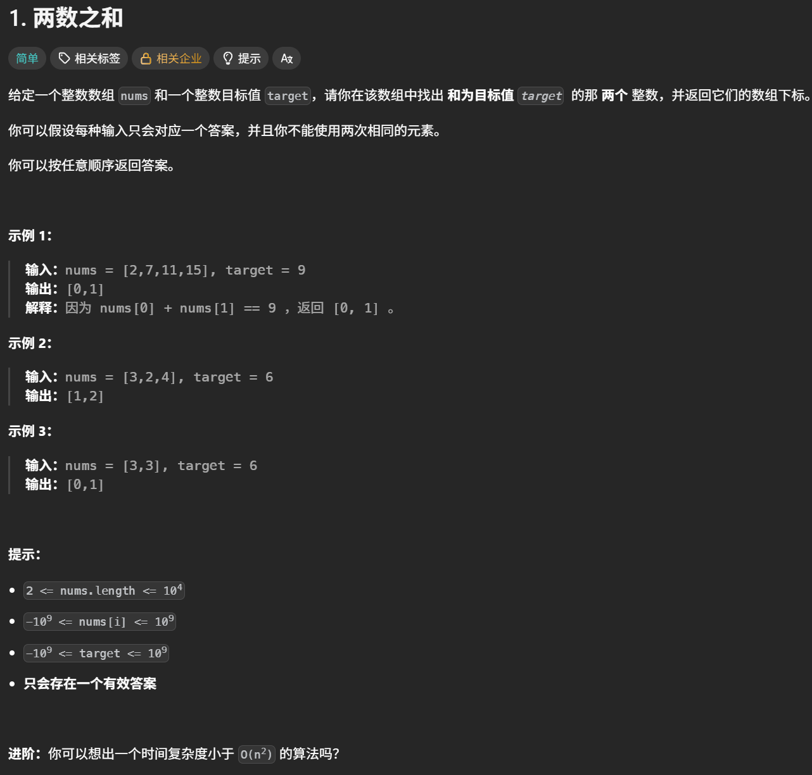
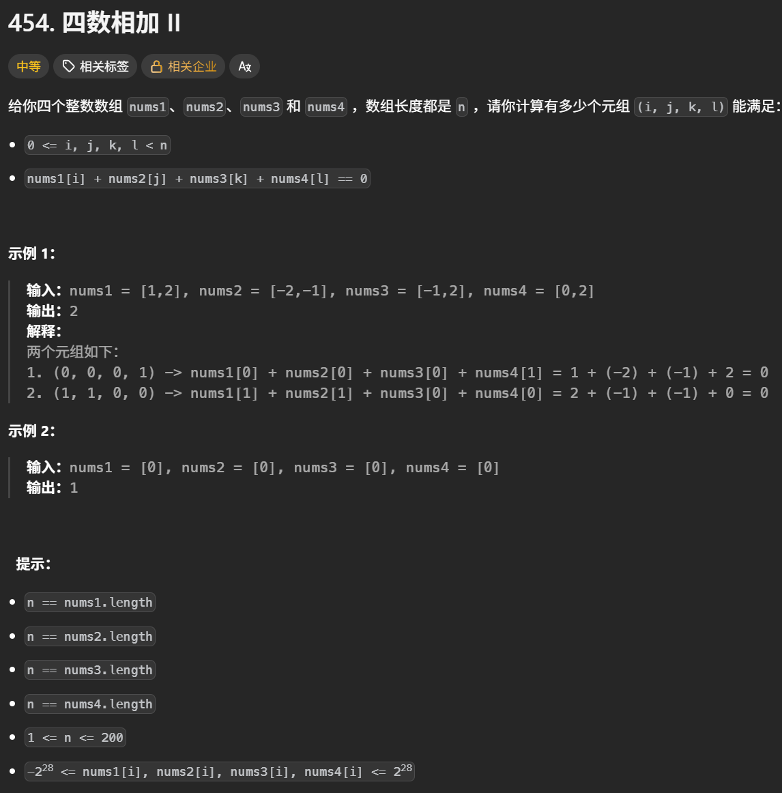
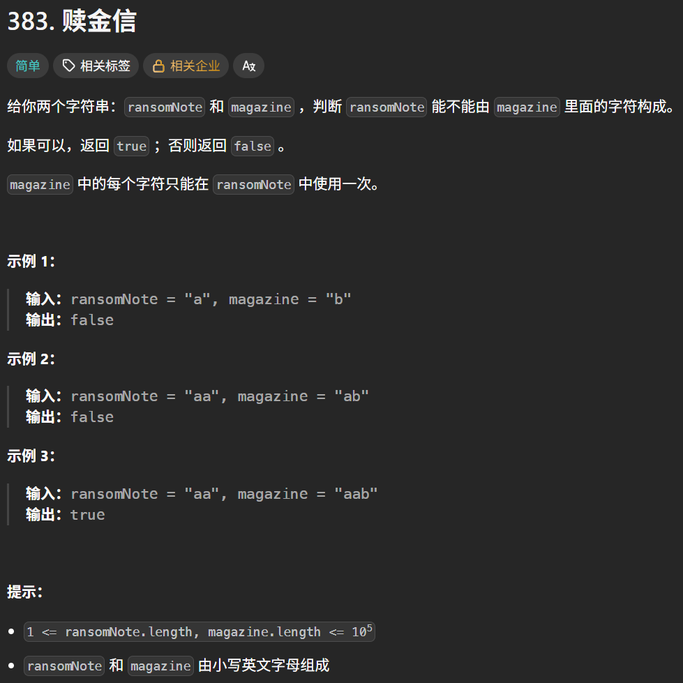
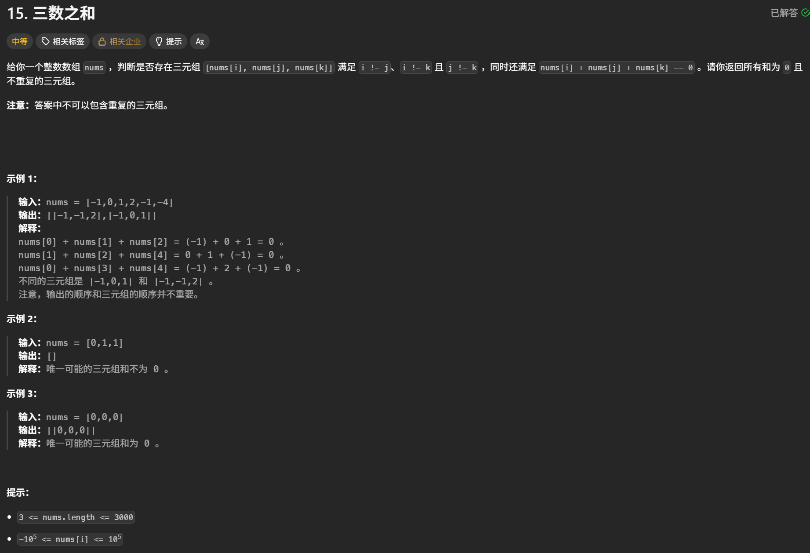
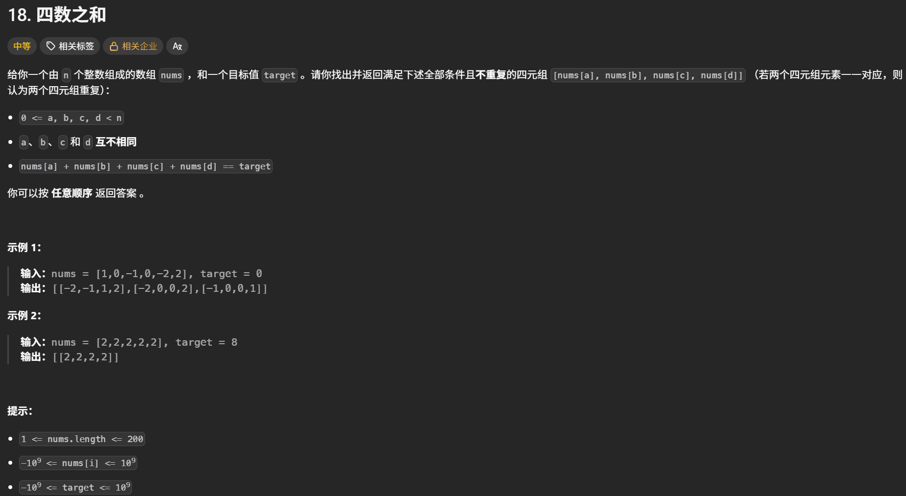

# 哈希表学习心得

本目录用于保存哈希表专题的实现代码，并记录算法思路、易错点和个人复盘。

## 学习内容

- [x] 哈希表理论基础
- [x] 有效的字母异位词
- [x] 两个数组的交集
- [x] 快乐数
- [x] 两数之和
- [x] 四数相加 II
- [x] 赎金信
- [x] 三数之和
- [x] 四数之和

## 核心思路

- `set`：只关心元素是否出现，适合去重和快速判断存在性。
- `dict`：保存“键—值”映射，适合统计频次、记录下标或保存计算结果。
- 先确定查询条件，再选择键和值；键必须可哈希，字典中的键不重复。

## 易错点与边界条件

> - **选型**：只判断是否出现用 `set`；需要统计次数、记录下标或保存结果用 `dict`。
> - **字符计数**：固定数组只适用于已知字符范围（本题为 26 个小写字母），`ord` 转下标时要确认输入范围。
> - **集合交集**：`set` 会自动去重；转回列表用 `list(...)`，不要误写成“转换为字典”。
> - **快乐数**：用 `divmod` 拆分每一位；判断 `n == 1` 后再判断是否重复，重复说明进入循环。
> - **补数查找**：两数之和要先查 `target - num`，再保存当前值，避免同一个元素被使用两次。
> - **频次统计**：四数相加 II 要累加配对和出现的次数，不能只加 1；赎金信要逐次扣减库存。
> - **`dict.get`**：键不存在时返回 `None`，不能直接按整数 0 判断；`defaultdict(int)` 会自动提供默认值 0。
> - **排序双指针**：三数之和、四数之和必须先排序；对每一层固定值以及命中后的左右指针都要去重。
> - **循环边界与剪枝**：双指针使用 `left < right`；排序后的安全剪枝要结合正负数和目标值，内层提前结束用 `break`，不能误用 `return`。

## 复盘

> - **方法演进**：从字符/数字频次统计，逐步掌握集合去重、字典补数、配对和计数，再过渡到排序加双指针。
> - **关键细节**：哈希表的键保存“可查询的信息”（字符、数值或配对和），值保存频次、下标或计数结果。
> - **最易出错处**：重复元素的跳过条件、`left/right` 移动顺序、`break` 与 `return` 的作用范围，以及命中后仍要继续寻找其他组合。

## 代码记录

#### 有效的字母异位词

[有效的字母异位词](https://leetcode.cn/problems/valid-anagram/description/)


```python
class Solution:
    def isAnagram(self, s: str, t: str) -> bool:
        record = [0] * 26 #定义一个长度为
        #记录t中的每个字母出现的次数
        for i in t:
            record[ord(i) - ord('a')] += 1
        #记录s中的每个字母出现的次数
        for i in s:
            record[ord(i) - ord('a')] -= 1
        #判断record数组里是否全为0
        for i in range(26):
            if record[i] != 0:
                return False
        return True
```

ord(单个字符),用于将单个字符转换为对应的Unicode编码整数

#### 两个数组的交集

[两个数组的交集](https://leetcode.cn/problems/intersection-of-two-arrays/description/)


##### 使用数组的方法

```python
class Solution:
    def intersection(self, nums1: List[int], nums2: List[int]) -> List[int]:
        #这道题没有限制数组大小，所以不能使用数组来做哈希表
        count1 = [0] * 1001
        count2 = [0] * 1001
        result = []
        #统计nums1数组中每个数字出现的次数
        for i in range(len(nums1)):
            count1[nums1[i]] += 1
        #统计nums2数组中每个数字出现的次数
        for i in range(len(nums2)):
            count2[nums2[i]] += 1
        #查找两个数组中相同的元素
        for k in range(1001):
            if count1[k] * count2[k] != 0:#说明第k个元素两个数组都有
                result.append(k)
        return result
```

##### 使用集合的方法

```python
class Solution:
    def intersection(self, nums1: List[int], nums2: List[int]) -> List[int]:
        #set(nums),将nums转换为集合
        #集合内的元素不可重复，两个集合之间可以进行取交集操作，取并集的操作
        #  集合1  &  集合2  =可以取出两个集合的交集
        #  集合1  |  集合2  =可以取出两个集合的并集
        #  list() 可以将括号内的数据类型转换为字典类型
        return list(set(nums1) & set(nums2))
```

#### 快乐数

[快乐数](https://leetcode.cn/problems/happy-number/description/)


```python
class Solution:
    def getsum(self , n : int) -> int:
        newsum = 0
        while n:
            n , r = divmod(n , 10)#得到除以10的商和余数
            newsum += r**2
        return newsum
    def isHappy(self, n: int) -> bool:
        record = set() #记录sum是否重复出现
        while True:
            n = self.getsum(n) #获取每个位置上数的平方和
            if n == 1:
                return True
            if n in record:#只要n重复出现了，就不是快乐数
                return False
            else:
                record.add(n)
```

divmod（a,b）用来同时计算两个数相除的商和余数。等价于（a // b , a % b）

#### 两数之和

[两数之和](https://leetcode.cn/problems/two-sum/description/)



```python
class Solution:
    def twoSum(self, nums: List[int], target: int) -> List[int]:
        records = dict() #字典，记录遍历数组中的值和下标

        for i , num in enumerate(nums):
            comp = target - num
            if comp in records:#判断字典中是否有value=comp的键，如果有的话，就返回对应的键
                return [records[comp],i]
            records[num] = i#没有的话，就把当前元素的值和下标存入字典中
```

#### 四数相加 II

[四数相加 II](https://leetcode.cn/problems/4sum-ii/description/)



```python
class Solution:
    def fourSumCount(self, nums1: List[int], nums2: List[int], nums3: List[int], nums4: List[int]) -> int:
        hashmap = dict() #记录nums1和nums2中元素相加的值和对应出现的次数
        for n1 in nums1:
            for n2 in nums2:
                value = n1 + n2#两元素之和
                if value in hashmap:#value重复出现
                    hashmap[value] += 1
                else:
                    hashmap[value] = 1#value第一次出现

        count = 0
        for n3 in nums3:
            for n4 in nums4:
                value = -n3 - n4 #n1 + n2 = -n3 - n4
                if value in hashmap:
                    count += hashmap[value] #不能只加1，要加n1+n2出现的次数
        return count
```

#### 赎金信

[赎金信](https://leetcode.cn/problems/ransom-note/)



```python
class Solution:
    def canConstruct(self, ransomNote: str, magazine: str) -> bool:
        #使用字典统计magazine 里每个字母出现的次数
        #hashmap =dict()
        hashmap =defaultdict(int)#当访问的键不存在时，会自动给这个键创建一个默认值

        for x in magazine:
            hashmap[x] += 1
            #获得了magazine里每个字母出现的次数了
        #遍历ransomNote里的每个字母，如果该字母出现在了hashmap的键里，那么让hashmap里的值减1
        for x in ransomNote:
            #value = hashmap.get(x)
            if hashmap[x] == 0:#当前字母magazine里没有了
                return False
            else:
                hashmap[x] -= 1#当前字母的次数减1
        return True

```

hashmap.get(x)返回数据类型是None或者int，所以我直接写if value == 0是错误的，此时value应该是None，应该写成if not value才对

#### 三数之和

[三数之和](https://leetcode.cn/problems/3sum/description/)



```python
class Solution:
    def threeSum(self, nums: list[int]) -> list[list[int]]:
        result = []#【a ，b ，c】
        nums.sort()#使用双指针的前提是数组要从小到大排序

        for i in range(len(nums)):
            #第一个元素大于0的话，直接返回空集，因为最小的元素都大于0了，后面的元素相加不可能等于0
            if nums[i] > 0:
                return result
            #对a去重
            if i > 0 and nums[i] == nums[i-1]:
                continue
            #left指针在i下标的后面一位
            left = i+1
            #right指针在数组末尾
            right = len(nums)-1
            while left < right:#题目要求元素的下标各不相同
                sumnew = nums[i] + nums[left] +nums[right]#a、b、c三个数之和
                if sumnew > 0:#说明三数之和大了，right要往左移动一位
                    right -= 1
                elif sumnew < 0:#说明三数之和小了，left要往右移动一位
                    left += 1
                else:#三数之和等于0，把当前组合存入result字典里
                    result.append([nums[i], nums[left], nums[right]])
                    #去重b和c
                    while right > left and nums[left] == nums[left + 1]:
                        left += 1
                    while right > left and nums[right] == nums[right - 1]:
                        right -= 1
                    left +=1
                    right -=1
        return result
```

#### 四数之和

[四数之和](https://leetcode.cn/problems/4sum/description/)



```python
class Solution:
    def fourSum(self, nums: List[int], target: int) -> List[List[int]]:
        #1.对数组排序
        nums.sort()
        #2.定义变量
        n = len(nums)
        result = []
        #3.定义两层循环+双指针
        for a in range(n):
            #4.先判断第一种特殊情况
            if nums[a] > target and nums[a] > 0:
                break #return result,return 会直接结束整个函数；break 只结束当前的 b 循环，通常更容易避免漏解
            #对a去重
            if a >  0 and nums[a] == nums[a-1]:
                continue
            for b in range(a+1 , n):
                #5.第二种特殊情况
                if nums[a] + nums[b] > target and target > 0:#因为前面两个数已经相加大于target并且target大于0，后面的数一定是正数且值更大
                    break#return result
                #对b去重,0改为了a+1，因为对于b来讲，a是固定的，要从a的下一位开始找
                if b > a+1 and nums[b] == nums[b-1]:
                    continue
                left = b+1
                right = n-1
                #6.双指针寻找c,d
                while left < right:
                    sumnew = nums[a] + nums[b] + nums[left] + nums[right]
                    if sumnew > target:#说明值大了，right要往左移动一位
                        right -= 1
                    elif sumnew < target:#说明值小了，left要往右移动一位
                        left += 1
                    else:
                        result.append([nums[a],nums[b],nums[left],nums[right]])
                        #去重c,d
                        while right > left and nums[left] == nums[left + 1]:
                            left += 1
                        while right > left and nums[right] == nums[right - 1]:
                            right -= 1
                        left += 1
                        right -= 1
        return result

```

不管n数之和，思路是：
1.排序

2.固定n-2层循环

3.每层循环都有去重，去重要比较当前数与前一位数是否相等

4.双指针寻找最后两位数

5.对最后两位数去重
