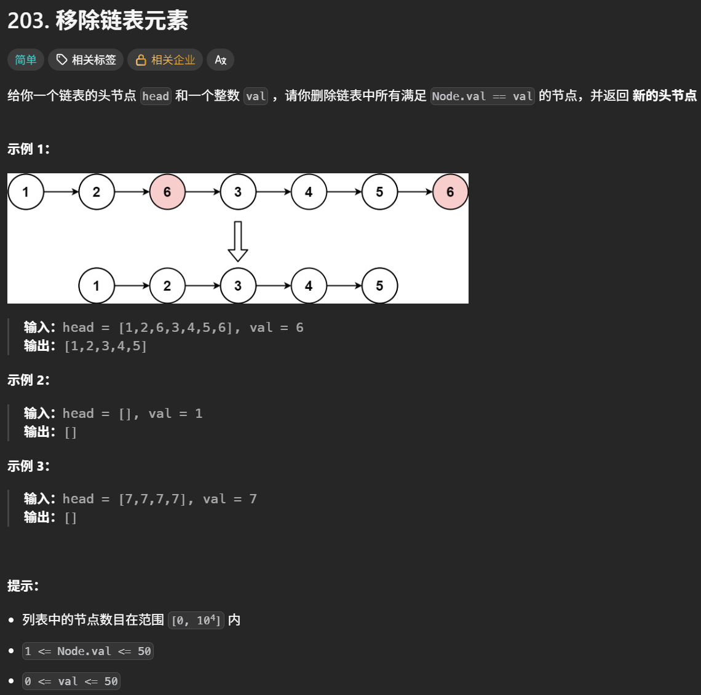
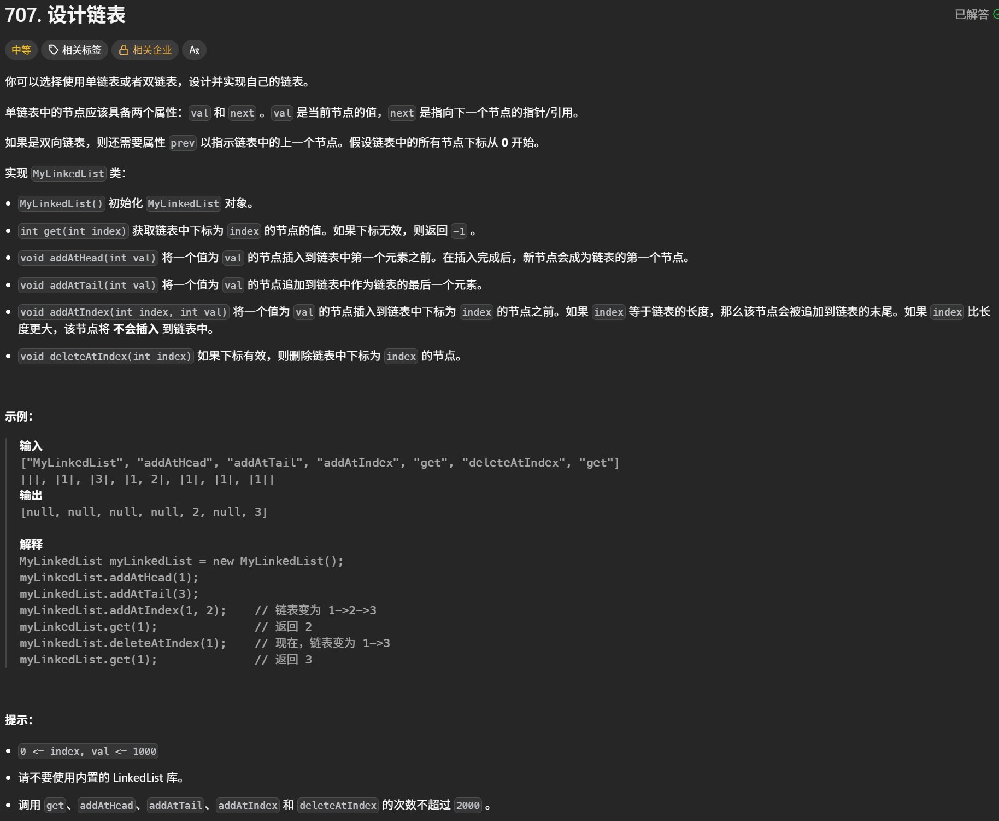
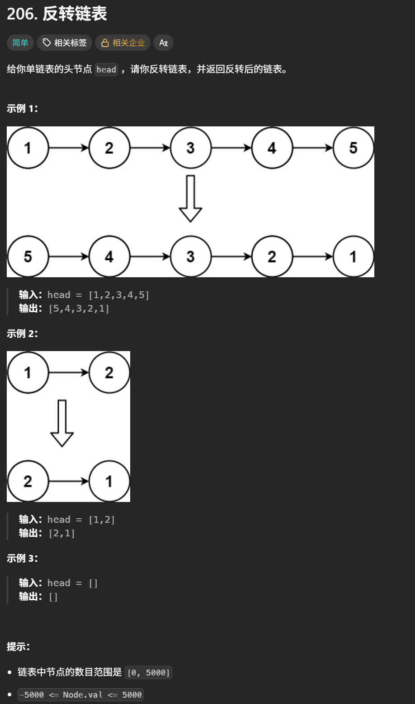
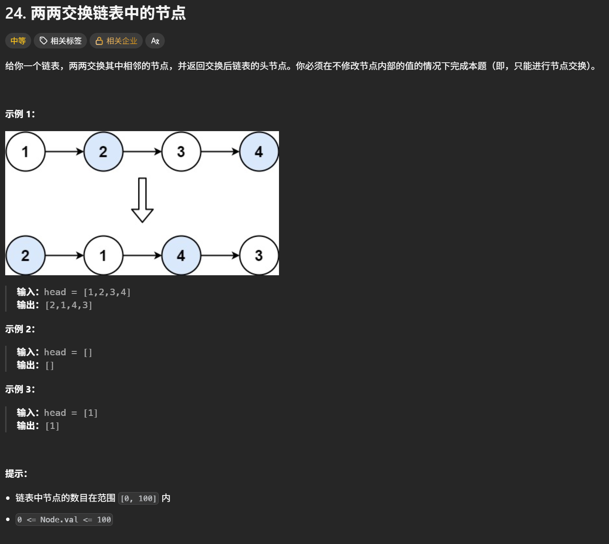

# 链表学习心得

本目录用于保存链表专题的实现代码，并持续记录个人学习心得。

## 今日资料

- 《代码随想录》链表（V3.0）
- 本地资料：`D:\work\算法pdf\2.《代码随想录》链表.（V3.0）.pdf`

## 学习内容

- [x] 链表理论基础
- [ ] 移除链表元素
- [ ] 设计链表
- [ ] 翻转链表
- [ ] 两两交换链表中的节点
- [ ] 删除链表的倒数第 N 个节点
- [ ] 链表相交
- [ ] 环形链表 II
- [ ] 链表总结

## 学习心得

### 核心思路

> - 链表定义
>
>   ```python
>   # 1. 定义节点 
>   class ListNode: 
>       def __init__(self, val=0, next=None): 
>           self.val = val       # 节点存储的值 
>           self.next = next     # 下一个节点，默认为 None 
>   # 2. 创建链表：1 → 2 → 3 
>   head = ListNode(1) 
>   head.next = ListNode(2) 
>   head.next.next = ListNode(3) 
>   # 3. 遍历链表 
>   current = head 
>   while current is not None: 
>       print(current.val) 
>       current = current.next
>   ```
>
> - 删除链表中的元素
>
>   设置一个虚拟头结点，这样链表中所有元素都可以按照同一个方式进行移除

### 易错点与边界条件

> 在这里记录空链表、单节点、头节点变化、指针越界和成环等易错情况。

### 复杂度总结

> 在这里记录各实现的时间复杂度、空间复杂度及其取舍。

### 复盘

> 在这里逐题记录遇到的问题、错误原因、修正方法和需要重做的内容。

## 力扣代码

#### 移除链表元素

1. [203. 移除链表元素](https://leetcode.cn/problems/remove-linked-list-elements/description/)



```
# Definition for singly-linked list.
# class ListNode:
#     def __init__(self, val=0, next=None):
#         self.val = val
#         self.next = next
class Solution:
    #Optional的意思是创建的head可以是指定的ListNode类型，也可以是None
    def removeElements(self, head: Optional[ListNode], val: int) -> Optional[ListNode]:
        dummyhead = ListNode(0)#定义一个虚拟的头结点
        dummyhead.next = head #指向链表的头节点
        cur = dummyhead#用来遍历链表
        while  cur.next is not None:
            if cur.next.val == val:
                cur.next = cur.next.next
            else:
                cur = cur.next
        head = dummyhead.next
        return head
```

head: Optional[ListNode]，意思是定义的head可以是None也可以是ListNode，他通常会把类型标注和赋值一起写：

```python
定义空链表：head: Optional[ListNode] = None
创建头节点：head: Optional[ListNode] = ListNode(1)
```

#### 设计链表

2. [707. 设计链表](https://leetcode.cn/problems/design-linked-list/description/)



```
class ListNode:
    def __init__(self,val=0,next=None):
        self.val = val 
        self.next = next
class MyLinkedList:

    def __init__(self):
        self.dummyhead = ListNode()
        self.size = 0

    def get(self, index: int) -> int:
        if index < 0 or index >= self.size:
            return -1
        cur = self.dummyhead.next #指向链表头节点的整体
        for i in range(index):#index=0时，不移动
            cur = cur.next
        return cur.val

    def addAtHead(self, val: int) -> None:
        temp = ListNode(val)
        temp.next = self.dummyhead.next#现在temp.next指向原先的头节点
        self.dummyhead.next = temp
        self.size += 1

    def addAtTail(self, val: int) -> None:
        temp = ListNode(val)
        cur = self.dummyhead
        while cur.next !=None:
            cur = cur.next
        cur.next = temp
        self.size += 1

    def addAtIndex(self, index: int, val: int) -> None:
        if index < 0 or index > self.size:
            return None
        cur = self.dummyhead
        while index:
            cur = cur.next
            index -=1
        cur.next = ListNode(val , cur.next)
        self.size +=1

    def deleteAtIndex(self, index: int) -> None:
        if index < 0 or index >= self.size:
            return None
        cur = self.dummyhead
        while index:
            cur = cur.next
            index -=1
        cur.next = cur.next.next
        self.size -=1
```

下面是执行用时优化的版本

```
class ListNode:
    def __init__(self,val=0,next=None):
        self.val = val 
        self.next = next
class MyLinkedList:

    def __init__(self):
        self.dummyhead = ListNode()
        self.size = 0
        self.tail = self.dummyhead

    def get(self, index: int) -> int:
        if index < 0 or index >= self.size:
            return -1
        cur = self.dummyhead.next #指向链表头节点的整体
        for _ in range(index):#index=0时，不移动
            cur = cur.next
        return cur.val

    def addAtHead(self, val: int) -> None:
        self.dummyhead.next = ListNode(val,self.dummyhead.next)
        if self.size == 0:
            self.tail = self.dummyhead.next
        self.size += 1

    def addAtTail(self, val: int) -> None:
        self.tail.next = ListNode(val)
        self.tail = self.tail.next
        self.size += 1

    def addAtIndex(self, index: int, val: int) -> None:
        if index < 0 or index > self.size:#可以在index=size的位置添加结点，但是不能在这个位置删除结点
            return None
        if index == self.size:
            self.addAtTail(val)
            return
        cur = self.dummyhead
        for _ in range(index):
            cur = cur.next
        cur.next = ListNode(val, cur.next)
        self.size += 1

    def deleteAtIndex(self, index: int) -> None:
        if index < 0 or index >= self.size:
            return None
        cur = self.dummyhead
        for _ in range(index):
            cur = cur.next
        #必须在删除之前判断删除的结点是否是尾结点
        if cur.next == self.tail:
            self.tail = cur
        cur.next = cur.next.next
        self.size -=1
```

#### 反转链表

1. [206. 反转链表](https://leetcode.cn/problems/reverse-linked-list/description/)



##### 双指针法

```
class Solution:
    def reverseList(self, head: Optional[ListNode]) -> Optional[ListNode]:
        temp = None #存储cur的next，也就是cur的下一个结点
        cur = head #cur相当于head
        pre = None #指向最后一个结点
        while cur is not None:
            temp = cur.next #临时存储cur的下一个结点
            cur.next = pre #反转结点指向
            pre = cur #pre指向头节点
            cur = temp #cur再重新指向下一个结点
        return pre
```

##### 递归法

```
class Solution:
    def reverse(self , cur , pre):
        if cur == None:
            return pre
        temp = cur.next #先保存下一个结点的地址
        cur.next = pre #保存完之后，把当前结点的指针域改为None
        return self.reverse(temp , cur)#开始下一个结点与倒数第二个结点互换

    def reverseList(self, head: Optional[ListNode]) -> Optional[ListNode]:
        return self.reverse(head , None)
```

#### 两两交换链表中的节点

[24. 两两交换链表中的节点](https://leetcode.cn/problems/swap-nodes-in-pairs/description/)



```
class Solution:
    # 1 --> 2 --> 3 --> 4 --> None
    def swapPairs(self, head: Optional[ListNode]) -> Optional[ListNode]:
        dummyNode = ListNode(0 , head) #虚拟头节点指向真实的头节点
        cur = dummyNode #用于后面的删除操作
        while cur.next != None and cur.next.next != None:#如果最后只剩一个结点，或者cur移动到了最后一个结点，是不需要继续交换的
            temp1 = cur.next #记录真实头节点位置
            temp2 = cur.next.next.next#记录第三个结点位置

            cur.next = cur.next.next #第二个结点与第一个结点交换
            cur.next.next = temp1
            cur.next.next.next = temp2
            cur = cur.next.next #cur向后移动两位
        return dummyNode.next

```

