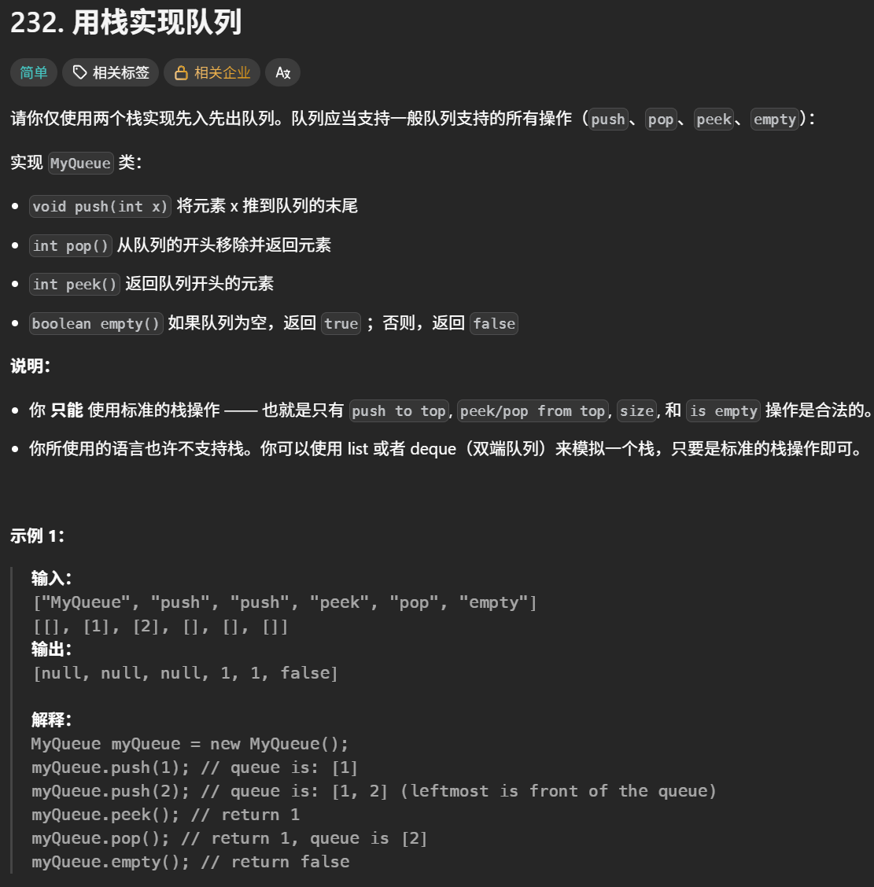
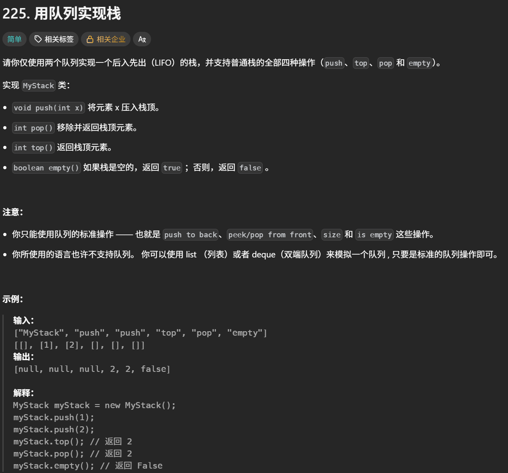
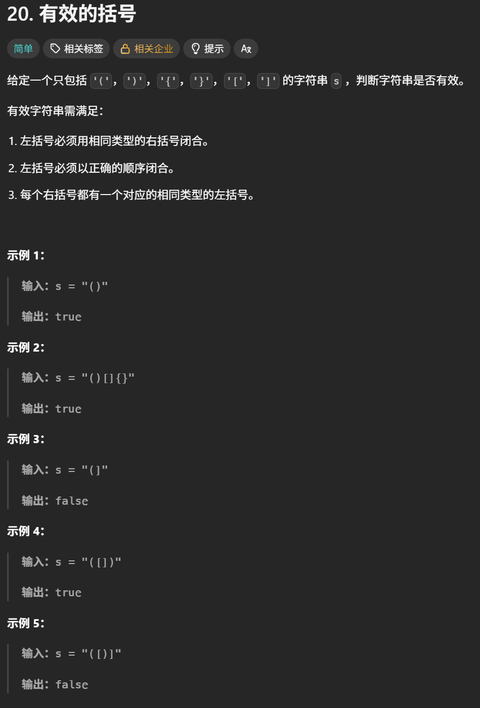
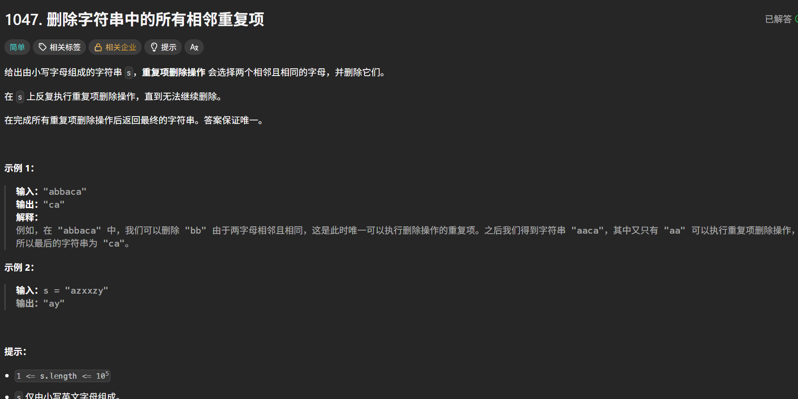
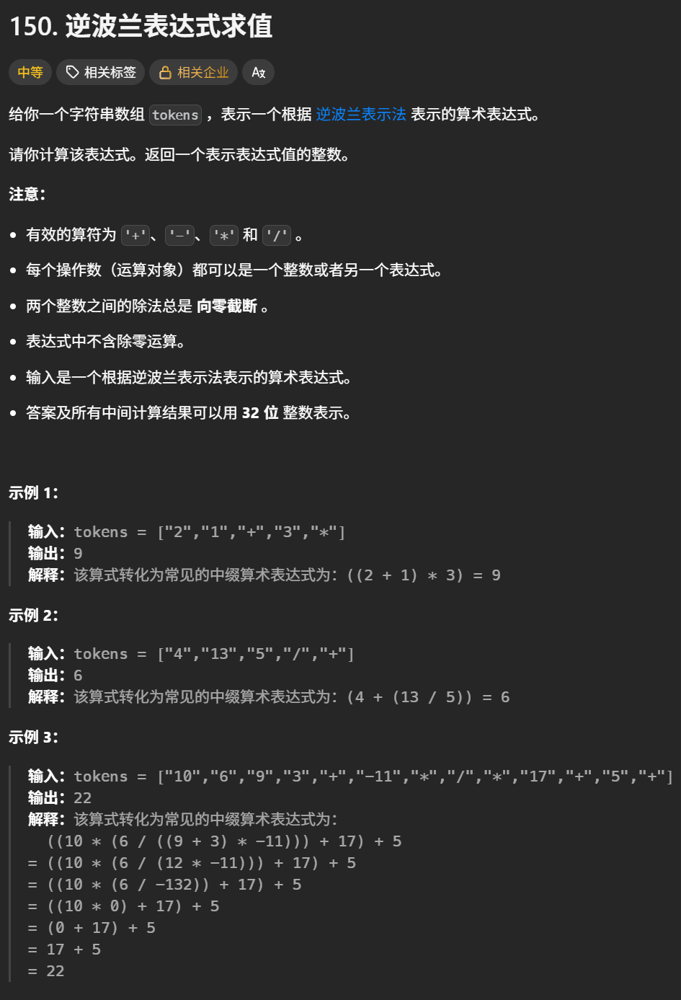
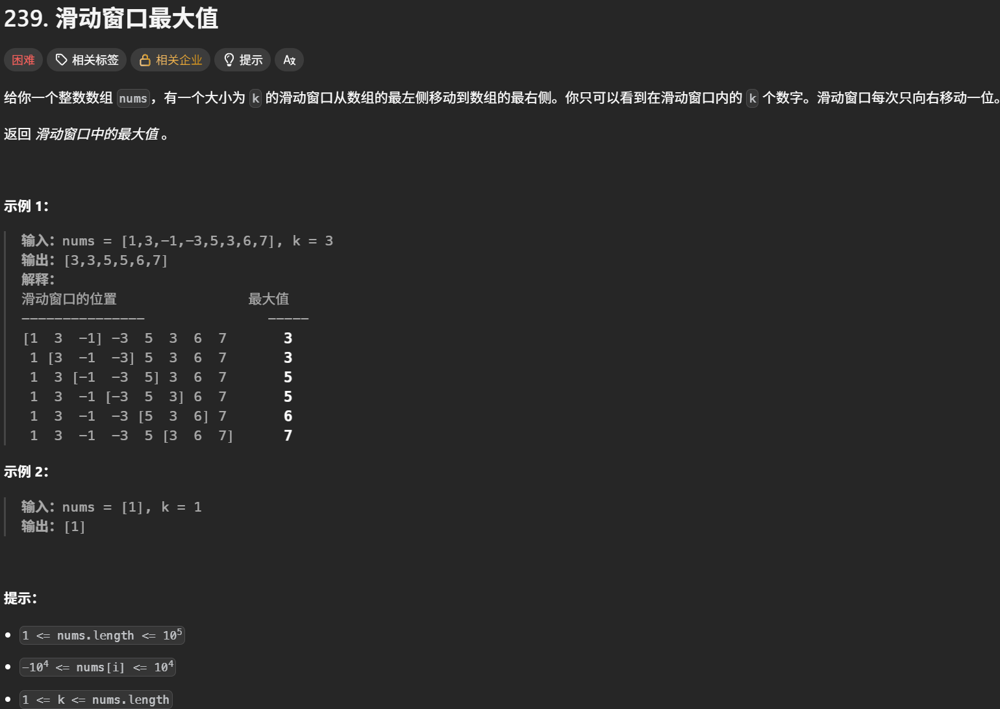
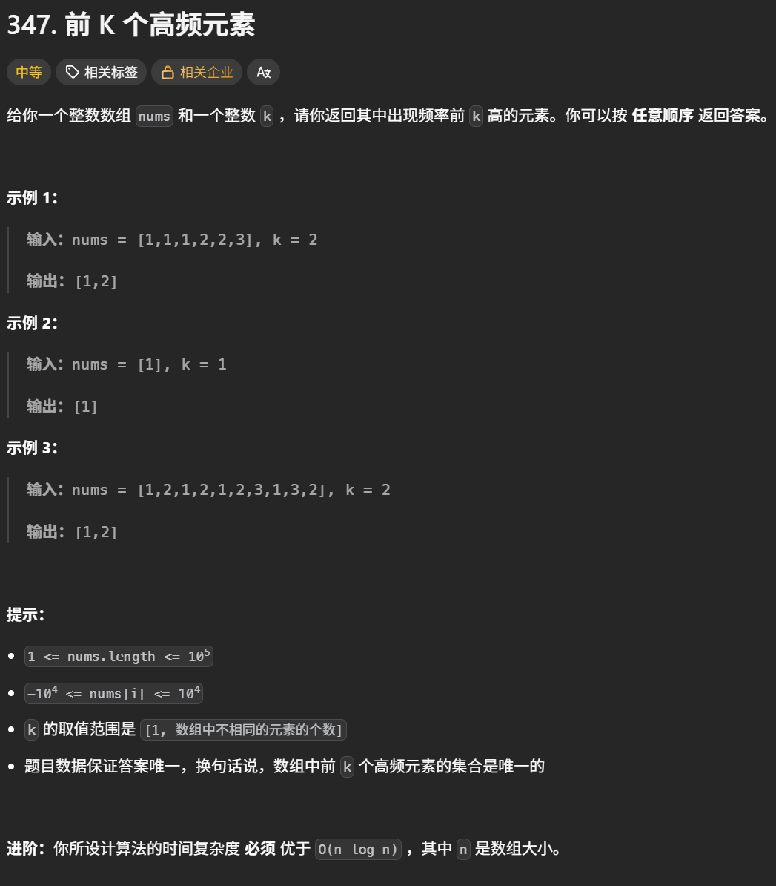

# Stock 学习心得

本目录用于记录股票类动态规划问题的实现代码、解题思路、易错点和复盘结论。

## 学习内容

- [x] 用栈实现队列
- [x] 用队列实现栈
- [x] 有效的括号
- [x] 逆波兰表达式
- [x] 滑动窗口最大值
- [x] 前k个高频元素

## 核心思路

- 用持有股票和不持有股票表示每天的状态，分别记录两种状态下的最大收益。
- 根据题目限制增加冷冻期、交易次数或手续费等状态，并明确每天的状态转移顺序。
- 先写出状态定义和转移方程，再根据依赖关系压缩数组空间。

## 易错点与边界条件

- **用栈实现队列**：输入栈负责进队，输出栈负责出队；只有输出栈为空时才把输入栈全部转移过去，否则会破坏先进先出顺序。两栈都为空时，pop 和 peek 不能继续取值。
- **用队列实现栈**：每次 pop 或 top 都要把前面的 n-1 个元素移到队尾，循环范围应是 len(queue) - 1；不能直接用 deque 的下标访问来绕过题目限制。
- **有效的括号**：遇到左括号时压入对应的右括号，遇到右括号时检查栈顶；栈为空或括号不匹配立即返回 False，遍历结束后栈也必须为空。空字符串属于合法情况。
- **删除相邻重复项**：访问栈顶前先判断栈是否为空；删除后可能触发新的相邻重复，因此必须继续按顺序处理，最后用 join 还原字符串。
- **逆波兰表达式**：先弹出的是右操作数 y，后弹出的是左操作数 x；除法必须向零取整，不能误用向下取整。负数是操作数，不应被误判为运算符。
- **滑动窗口最大值**：单调队列从队尾删除不可能成为最大值的元素，从队首读取当前最大值；移出窗口的元素只有在等于队首时才能弹出。k 为 1、k 等于数组长度和重复元素是重点边界，实际工程中用下标存储会比只存数值更稳妥。
- **前 k 个高频元素**：先统计频率，再用小顶堆保持堆大小不超过 k；堆中应保存频率和元素的对应关系，结果列表长度必须为 k。注意导入 defaultdict、heapq，频率相同不要求固定输出顺序。
- **通用边界**：测试空输入、单个元素、全部相同、操作对象为空、k = 1、k = n，以及恰好触发一次或多次转移、弹出和消除的情况。

## 复盘

1. 本章先通过栈和队列模拟另一种线性结构，再进一步使用栈处理匹配与消除问题，最后学习单调队列和堆维护动态数据。
2. 最容易出错的是“数据结构不变量”：双栈要维持先进先出，括号栈顶要表示当前期待的右括号，单调队列要保持从队首到队尾递减，小顶堆要始终保留当前前 k 个频率。
3. 逆波兰表达式强化了运算顺序和整数除法规则；滑动窗口最大值强化了窗口移动时的移入、移出顺序；前 k 个高频元素强化了计数、堆容量和结果回填。
4. 复杂度方面，双栈队列的转移是均摊 O(1)；括号匹配、相邻消除、逆波兰表达式和单调队列通常为 O(n)；小顶堆解法为 O(n log k)。这些方法的辅助空间通常为 O(n) 或 O(k)。
5. 后续复习重点：手动模拟两栈转移、括号不匹配、连续消除、负数除法、窗口重复元素和频率相同的堆操作，并补充空输入与非法操作测试。

## 代码记录

> 在这里补充每道股票算法题的题目链接、实现代码和个人学习笔记。

#### 用栈实现队列

[用栈实现队列](https://leetcode.cn/problems/implement-queue-using-stacks/description/)



```python
class MyQueue:
#队列是先进先出，栈是先进后出
    def __init__(self):
        self.stock_in = [] #进栈
        self.stock_out = [] #出栈

    def push(self, x: int) -> None:
        self.stock_in.append(x)#把元素加进来只需要把x push进来

    def pop(self) -> int:
        if self.stock_out:
            return self.stock_out.pop()
        else:
            for i in range(len(self.stock_in)):
                self.stock_out.append(self.stock_in.pop())
            return self.stock_out.pop()

    def peek(self) -> int:
        res = self.pop()
        self.stock_out.append(res)
        return res

    def empty(self) -> bool:
        if len(self.stock_in) !=0 or len(self.stock_out) != 0:
            return False
        else:
            return True
```

#### 用队列实现栈

[用队列实现栈](https://programmercarl.com/algo/stack-queue/0225-implement-stack-using-queues.html#%E5%85%B6%E4%BB%96%E8%AF%AD%E8%A8%80%E7%89%88%E6%9C%AC)



```python
#deque() 是 Python 中的“双端队列”
#它支持在队列的两端快速添加和删除元素
#1.创建deque队列
queue = deque()
#2.从右端添加元素
queue.append(1)
queue.append(2)
print(queue)#deque([1,2])
#3.从左端添加元素
queue.appendleft(0)
print(queue)#deque([0,1,2])
#4.从右端删除元素
queue.pop()#删除并返回右边元素2
#5.从左端删除元素
queue.popleft()#删除并返回左边元素0
```

```python
class MyStack:

    def __init__(self):
        self.que = deque()#定义一个两端都可以操作的数据结构

    def push(self, x: int) -> None:
        self.que.append(x) #从右端加进去

    def pop(self) -> int:
        for i in range(len(self.que) - 1):#不包含最右端元素
            self.que.append(self.que.popleft())
        return self.que.popleft()

    def top(self) -> int:
        #违反题目要求：只能使用队列的标准操作
        #return self.que[-1]
        #1.先把除了栈顶的元素全部移动到栈顶的右边
        for i in range(len(self.que) - 1):
            self.que.append(self.que.popleft())
        temp = self.que.popleft()
        self.que.append(temp)
        return temp

    def empty(self) -> bool:
        return not self.que
```

#### 有效的括号

[有效的括号](https://leetcode.cn/problems/valid-parentheses/description/)



```python
class Solution:
    def isValid(self, s: str) -> bool:
        #定义栈
        stack = []
        #遇到左括号时，应把对应的右括号压入栈中，而不是遇到右括号时压入左括号
        #因为栈的特点是“后进先出”，遇到左括号时，暂时无法判断它是否匹配，需要把它期待的右括号保存起来
        for i in s:
            if i == '(':
                stack.append(')')
            elif i == '[':
                stack.append(']')
            elif i == '{':
                stack.append('}')
            elif not stack or stack[-1] != i:#1.如果当前栈为空但是又出现了右括号，说明一定是不合法的，因为没有左括号和他进行匹配了。2.当前右括号与栈顶期待的右括号不一致，eg:(}),这是不合法的
                return False
            else:
                stack.pop()
        if not stack:
            return True
        else:
            return False
```

#### 删除字符串中的所有相邻重复项

[删除字符串中的所有相邻重复项](https://leetcode.cn/problems/remove-all-adjacent-duplicates-in-string/description/)



```python
class Solution:
    def removeDuplicates(self, s: str) -> str:
        #初始化栈
        stack = []
        for i in s:
            if stack and i == stack[-1]:#如果当前元素与栈顶元素相同，就把栈顶元素pop掉
                stack.pop()
            else:
                stack.append(i)
        return ''.join(stack)
```

#### 逆波兰表达式

[逆波兰表达式求值](https://leetcode.cn/problems/evaluate-reverse-polish-notation/description/)



```python
class Solution:
    #因为逆波兰表达式的取整是要求向零取整的，所以要写一个向零取整的函数
    def mydev(self , x , y):
        if x * y > 0:
            return int(x / y)
        else:
            return int(- (abs(x) / abs(y)))#号时使用 /，结果会变成浮点数,所以要加数据类型变换int
    def evalRPN(self, tokens: List[str]) -> int:
        #初始化栈
        op_map = {'+':add , '-':sub , '*':mul , '/':self.mydev}
        stack = []
        for i in tokens:
            if i not in {'+' , '-' , '*' , "/"}:
                stack.append(int(i))
            else:
                y = stack.pop()#弹出栈顶元素
                x = stack.pop()
                stack.append(op_map[i](x,y))#先出来的元素要在运算符的后面
        return stack.pop()
```

#### 滑动窗口最大值

[滑动窗口最大值](https://leetcode.cn/problems/sliding-window-maximum/description/)



```python
#定义一个单调递减的队列
class Myque:
    def __init__(self):
        self.que = deque()#两端都可以操作的数据结构
    def pop(self , value):
        #弹出元素之前，先比较要弹出的元素与出口的元素大小，如果相等，直接弹出
        if self.que and value == self.que[0]:
            self.que.popleft()
    def push(self , value):
        #加入元素之前先判断要加入的元素与队列末尾的元素大小关系，如果大于，就把末尾的元素pu弹出，直至弹完为止
        while self.que and value > self.que[-1]:
            self.que.pop()
        self.que.append(value)
    def front(self):
        #直接返回队列最前端的值，该值就是最大值
        return self.que[0]
class Solution:
    def maxSlidingWindow(self, nums: List[int], k: int) -> List[int]:
        result = []
        #先把第一个窗口的值依次送进队列中
        que = Myque()
        for i in range(k):
            que.push(nums[i])
        #记录第一个窗口的最大值
        result.append(que.front())
        for j in range(k , len(nums)):
            #1.先移除上一个窗口的第一位元素，即下标是j-k
            que.pop(nums[j - k])
            #2.把当前窗口的最后一个元素加入队列，即下标是j
            que.push(nums[j])
            #3.取出当窗口的最大值
            result.append(que.front())
        return result
```

#### 前k个高频元素

[前k个高频元素](https://leetcode.cn/problems/top-k-frequent-elements/description/)



```python

class Solution:
    def topKFrequent(self, nums: list[int], k: int) -> list[int]:
        #统计每个元素出现的次数
        mymap = defaultdict(int)
        for i in nums:
            mymap[i] += 1
        #对频率进行排序，取前k个元素，因为每次要pop最小的元素，所以用小顶堆
        pre = []
        for key , freq in mymap.items():
            #mymap.items():返回mymap的键值对
            heapq.heappush(pre , (freq , key))#把键值对（freq，key）push到小顶堆里
            if len(pre) > k:
                heapq.heappop(pre)#pop堆顶最小元素
        #小顶堆先弹出最小元素
        result = [0] * k#定义数组要定义长度为k的列表
        for i in range(k-1 , -1 , -1):
            result[i] = heapq.heappop(pre)[1]
        return result

```
