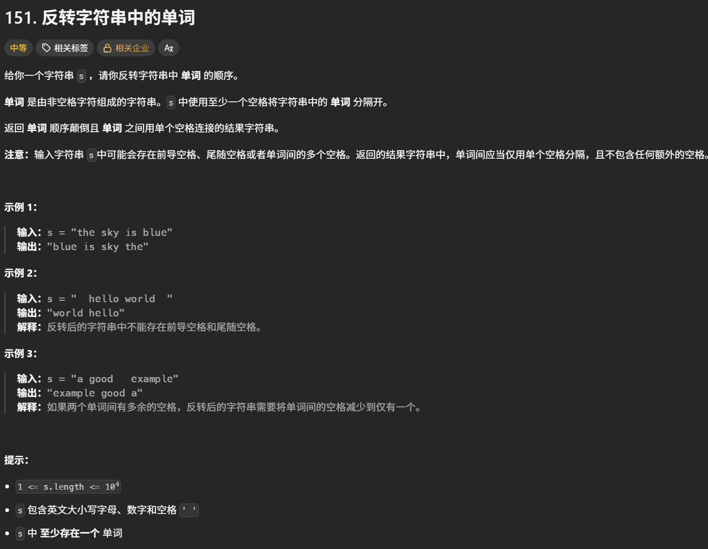
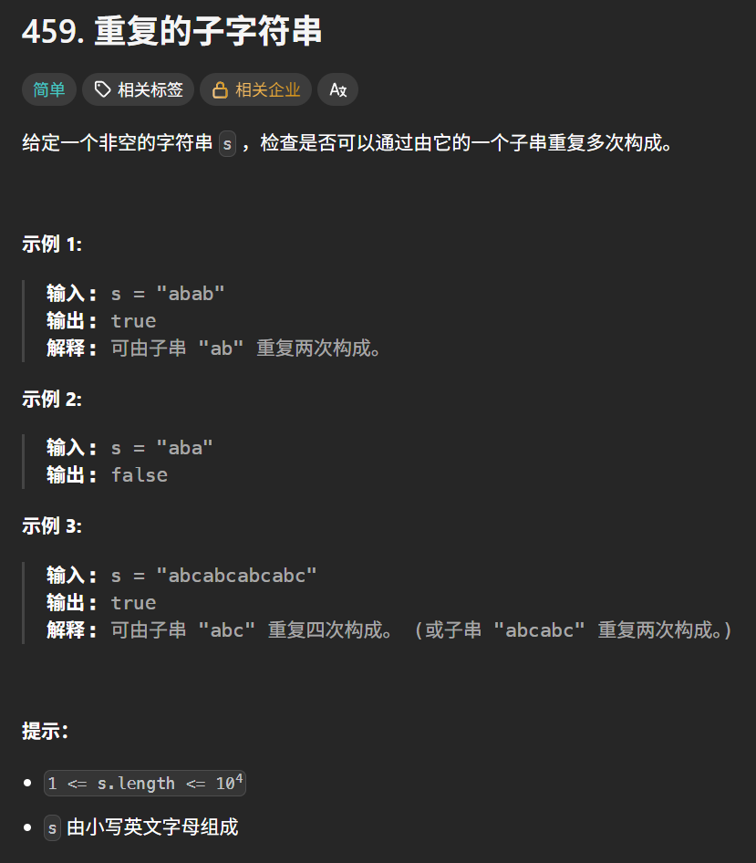

# 字符串学习心得

本目录用于保存字符串专题的实现代码，并记录算法思路、易错点、边界条件和个人复盘。

## 学习内容

- [x] 字符串理论基础
- [x] 反转字符串
- [x] 替换空格
- [x] 反转字符串中的单词
- [x] 左旋转字符串
- [x] 右旋转字符串
- [x] 实现 strStr()
- [x] 重复的子字符串

## 核心思路

- 根据题意选择遍历、双指针、滑动窗口、栈或字符串匹配算法。
- 处理字符时明确区分字符、字符串和下标，必要时先转换为列表再原地修改。
- 涉及空格、大小写或连续分隔符时，先明确题目要求的保留和删除规则。

## 易错点与边界条件

- **字符串不可直接修改**：Python 的 str 是不可变对象；需要逐字符修改时先用 list(s)，最后用 ''.join(chars) 还原。
- **反转区间统一使用左闭右开**：区间 [start, end) 的右端点应写成 end - 1，避免遗漏或越界；空串、单字符和长度为 0 的切片都要能正常处理。
- **反转字符串**：题目要求原地修改时不要返回新字符串；双指针交换结束条件可用 left < right，避免重复交换中间字符。
- **反转字符串 II**：按 2k 分组，只反转每组前 k 个字符；末尾不足 k 个时全部反转，介于 k 和 2k 之间时只反转前 k 个。Python 切片越界会自动截断。
- **空格与分隔符**：split() 不指定分隔符时会合并连续空白并去除首尾空白；join() 决定输出分隔符。要先确认题目是保留空格还是规范化空格。
- **替换空格**：只替换题目规定的目标字符，遍历时不要漏掉首尾位置；转换列表后再拼接，避免把字符和字符串混用。
- **反转单词**：整体反转、单词顺序反转和单词内部反转是三个不同操作；全空格或多空格输入经过 split() 后可能得到空列表。
- **左右旋转**：旋转算法中的区间必须与 target 对齐；target = 0 或等于字符串长度时结果不变。若题目未限制 target <= len(s)，应先取模。
- **负索引切片**：右旋转常写为 s[-k:] + s[:-k]；当 k 可能为 0、超过长度或字符串为空时，先用 k %= len(s) 并处理空串。
- **KMP / strStr**：必须统一“前缀表是否加 1”的定义；失配时回退到 next[j - 1]，不能直接令 j = 0 或让 j 变成负数。若允许空模式串，要在访问 next_array[0] 前单独处理。
- **重复子字符串**：find() 找不到返回 -1，判断应写 != -1；KMP 判定需同时满足最长相等前后缀长度大于 0，且最小周期长度能整除原字符串长度。
- **测试边界**：至少验证空串、单字符、全空格、连续空格、k = 0、k = len(s)、无匹配、完全匹配和恰好重复一次等情况。

## 复盘

1. 先用 split、切片和 join 写出直接解法，再用双指针和区间反转统一处理原地操作。
2. 本章反复出现的错误主要来自三类：把字符串当列表修改、左右端点的开闭不一致、以及负索引和空格规范化规则理解不清。
3. 左旋转、右旋转和反转字符串 II 本质上都可归纳为“划分区间后反转”或“切片重组”；写代码前先画出下标范围，能明显减少 off-by-one 错误。
4. strStr 和重复子字符串让我开始掌握 KMP：先构造前缀表，再在失配时复用已有匹配信息；关键是始终坚持同一种 next 数组定义。
5. 复杂度上，双指针和切片解法通常为 O(n)；KMP 的匹配过程为 O(n + m)。切片、split 和 join 会产生额外字符串或列表，空间复杂度通常为 O(n)。
6. 后续复习重点：手算几组前缀表、补齐空串和 k 边界测试，并区分“保留原空格”和“规范化空格”两类题意。

## 代码记录

#### 反转字符串

[反转字符串](https://leetcode.cn/problems/reverse-string/description/)


```python
class Solution:
    def reverseString(self, s: List[str]) -> None:
        """
        Do not return anything, modify s in-place instead.
        """
        left , right = 0 , len(s) - 1
        while left <= right:
            s[left] , s[right] = s[right] , s[left]
            left += 1
            right -= 1
```

s[left] , s[right] = s[right] , s[left]是python特有的，直接交换两个数

#### 反转字符串Ⅱ

[反转字符串Ⅱ](https://leetcode.cn/problems/reverse-string-ii/description/)


```
class Solution:
    def reverseStr(self, s: str, k: int) -> str:
        #先写一个函数用来把数组内的元素全部反转
        def myreverse(chars):
            left , right = 0 , len(chars) - 1
            while left < right:
                chars[left] , chars[right] = chars[right] , chars[left]
                left += 1
                right -= 1
            return chars
        res = list(s)#因为 Python 中的字符串 str 是不可变对象，不能直接修改其中某个位置的字符
        for cur in range(0 , len(s) , 2 * k):
            res[cur : cur + k] = myreverse(res[cur : cur + k])
        return ''.join(res)
```

分隔符.join(字符串序列)

eg：res = ['我', '爱', '你']  print(''.join(res))  结果是：我爱你

res = ['I', 'love', 'you'] print(' '.join(res))  结果是：I love you

#### 替换空格


```python
class Solution:
    def pathEncryption(self, path: str) -> str:
        res = list(path)
        for i in range(len(res)):
            if res[i] == '.':
                res[i] = ' '
        return ''.join(res)
```

#### 反转字符串中的单词



```python
class Solution:
    def reverseWords(self, s: str) -> str:
        s = s[::-1] #反转整个字符串
        return ' '.join(word[::-1] for word in s.split())
```

```python
word[::-1] for word in s.split()
#这是一个生成式表达式，含义是：
#s.split()：把字符串 s 按空格切分成单词列表
#word[::-1]：使用切片，将每个单词倒序。其中，[::-1] 可以理解为：[开始位置:结束位置:步长]
#for word in ...：依次遍历每个单词。
```

##### 分割法+双指针

```python
class Solution:
    def reverseWords(self, s: str) -> str:
        s = s.split() #将字符串拆分为单词，里面的空格全部会被去除
        #反转单词
        left , right = 0 , len(s) - 1
        while left < right:
            s[left] , s[right] = s[right] , s[left]
            left += 1
            right -= 1
        return ' '.join(s)
```

###### split函数用法

```python
字符串.split(分隔符, 最大切分次数)
1.不指定分隔符（不指定分隔符时，默认按照空格、多个空格、换行等空白字符切分）
s = "I love Python"
result = s.split()
print(result)#['I', 'love', 'Python']
2.指定分隔符（分隔符会被去掉）
s = "apple,banana,orange"
result = s.split(',')
print(result)#['apple', 'banana', 'orange']
3.指定切分次数（num表示最多切分num次）
s = "a-b-c-d"
result = s.split('-', 2)
print(result)#['a', 'b', 'c-d']
4.与join()配合使用
s = "hello world python"
words = s.split()
result = "-".join(words)
print(result)#hello-world-python
```

#### 左旋转字符串

[动态口令](https://leetcode.cn/problems/zuo-xuan-zhuan-zi-fu-chuan-lcof/description/)


```python
class Solution:
    def myreverse(self , start , end , s):
        left , right = start , end-1
        while left < right:
            s[left] , s[right] = s[right] , s[left]
            left += 1
            right -= 1
        return s
    def dynamicPassword(self, password: str, target: int) -> str:
        #1.反转前target-1个字符
        #2，反转第target个到末尾的字符
        #3.反转全部字符
        password = list(password)
        password = self.myreverse(0 , target , password)
        password = self.myreverse(target , len(password) , password)
        password = self.myreverse(0 , len(password) , password)
        return ''.join(password)
```

##### 更简单的方法

```python
class Solution:
    def dynamicPassword(self, password: str, target: int) -> str:
        return password[target:] + password[:target]
```

#### 右旋转字符串

[右旋转字符串](https://kamacoder.com/problempage.php?pid=1065)


```python
#获取输入的数字k和字符串
k = int(input())
s = input()

print(s[-k:] + s[:-k])
```

其中-k的意思是从字符串末尾反向计算位置

例如：

`s[-k:]`：从倒数第 `k` 个字符取到末尾；

`s[:-k]`：从开头取到倒数第 `k` 个字符之前；

负号表示从右往左数。

#### 实现strStr（）

[找出字符串中第一个匹配的下标](https://leetcode.cn/problems/find-the-index-of-the-first-occurrence-in-a-string/description/)


```python
class Solution:
    def getNext(self , next_array , s):
        #初始化next数组
        next_array[0]=0
        j = 0#前缀末尾
        i= 0#后缀末尾
        for i in range(1 , len(s)):
            #s[i]与s[j]不相等的情况
            while j > 0 and s[i] != s[j]:#j不能等于0，等于0的话就没有意义了，会卡死验证程序
                j = next_array[j - 1]
            if s[i] == s[j]:
                j += 1
            next_array[i] = j
    def strStr(self, haystack: str, needle: str) -> int:
        #题目说1 <= needle.length <= 10^4,所以不用考虑needle长度为0的情况
        #初始化next数组，长度和子串长度一样
        next_array = [0]*len(needle)
        #获取子串的next数组
        self.getNext(next_array , needle)
        j = 0#子串指针
        i = 0
        while i < len(haystack):
            while j > 0 and haystack[i] != needle[j]:
                j = next_array[j - 1]
            if haystack[i] == needle[j]:
                j += 1
            if j == len(needle):
                return i - j + 1
            i += 1
        return -1
```

#### 重复的子字符串

[重复的子字符串](https://leetcode.cn/problems/repeated-substring-pattern/)



##### 只要两个s拼接在一起，去掉头和尾，如果里面还有一个s的话，就说明s是由重复子串组成的

```python
#find() 用于查找子字符串在字符串中的第一次出现位置，返回下标；如果找不到，返回 -1
#字符串.find(要查找的内容, 开始位置, 结束位置)
s = "hello world"
print(s.find("world"))#6,因为w在s字符串里的下标是6
print(s.find("abc"))#-1，因为s字符串里没有abc子字符串
```

###### 使用find法

```python
class Solution:
    def repeatedSubstringPattern(self, s: str) -> bool:
        n = len(s)
        if n <= 1:
            return False
        ss = s[1:] + s[:-1]
        return ss.find(s) != -1
```

##### 当最长相等前后缀不包含的子串的长度可以被字符串s的长度整除，那么不包含的子串就是s的最小重复子串。最长相等前后缀的长度等于next[len - 1] （前缀表不加1）

###### KMP算法

```python
class Solution:
    def getNext(self , next_array , s):
        #初始化next数组
        next_array[0]=0
        j = 0 #前缀末尾
        i= 0#后缀末尾
        for i in range(1 , len(s)):
            #s[i]不等于s[j]
            while j > 0 and s[i] != s[j]:
                j = next_array[j-1]
            if s[i] == s[j]:
                j += 1
            next_array[i] = j
    def repeatedSubstringPattern(self, s: str) -> bool:
        n = len(s)
        next_array = [0] * n
        if n <= 1:
            return False
        self.getNext(next_array , s)
        if n % (n - next_array[n - 1]) == 0 and next_array[n-1]>0:#next_array[n - 1] > 0 用来判断字符串是否存在非空的最长相等前缀和后缀。只有这个长度大于 0，才可能由某个子串重复构成
            return True
        return False
```
